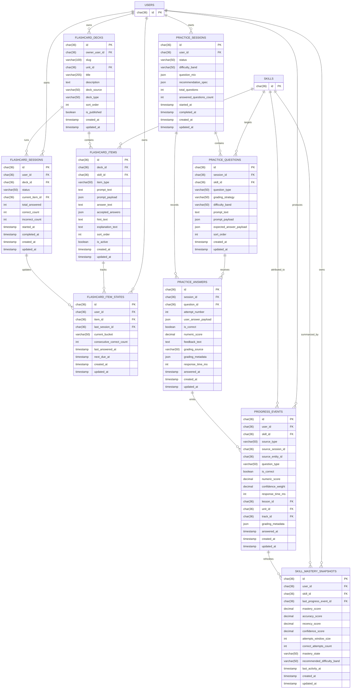

# ERD Learning Activity

## Scope
- Dokumen ini menyelesaikan task `ARCH-10`.
- Fokus utamanya mencakup tabel inti yang diminta oleh task: `flashcard_decks`, `flashcard_items`, `practice_sessions`, `practice_questions`, `practice_answers`, `progress_events`, dan `skill_mastery_snapshots`.
- Dokumen ini juga menambahkan dua supporting entity, `flashcard_sessions` dan `flashcard_item_states`, karena sequence diagram `POST /flashcards/sessions/:id/answer` dan rule Leitner bucket tidak bisa dimodelkan dengan aman tanpa state per session dan state per user-per-item.
- Relasi ke `users` dan `skills` diperlakukan sebagai external references dari ERD `ARCH-08` dan `ARCH-09`.

## Design Goals
- Menjaga ownership data tetap sesuai boundary module: `flashcards` dan `practice` menyimpan hasil internalnya sendiri lebih dulu, lalu `progress` menerima handoff event terstruktur.
- Menyediakan model persistence yang cukup untuk deterministic flashcard grading, AI-assisted practice grading, dan recompute mastery snapshot secara write-through.
- Menjaga atribusi `user -> skill -> learning event -> mastery snapshot` tetap stabil untuk dashboard, recommendation, dan future analytics.
- Mendukung deck bawaan sistem sekaligus custom deck milik user tanpa memaksa keduanya memakai perilaku katalog yang sama.

## Entity Relationship Diagram



## Relationship Notes
- `flashcard_decks 1 -> N flashcard_items`: satu deck berisi kumpulan item deterministik yang bisa diulang berkali-kali.
- `flashcard_decks 1 -> N flashcard_sessions`: satu user bisa membuka banyak session untuk deck yang sama di waktu berbeda.
- `flashcard_items 1 -> N flashcard_item_states`: state Leitner disimpan per `user + item`, bukan di tabel item global.
- `practice_sessions 1 -> N practice_questions`: satu session practice menghasilkan satu set pertanyaan.
- `practice_questions 1 -> N practice_answers`: MVP bisa memakai satu answer per question, tetapi relasi dibuat `1 -> N` agar retry/future replay tidak mematahkan schema.
- `practice_answers 1 -> N progress_events`: satu jawaban practice minimal menghasilkan satu event, tetapi model ini tetap aman bila nanti ada pemecahan event granular.
- `users 1 -> N progress_events` dan `users 1 -> N skill_mastery_snapshots`: progress selalu dihitung per user.
- `skills 1 -> N progress_events` dan `skills 1 -> N skill_mastery_snapshots`: skill adalah level terkecil yang diatribusikan dan diringkas oleh domain `progress`.
- `users 1 -> N flashcard_decks`: satu user bisa memiliki banyak custom deck; deck bawaan sistem memakai `owner_user_id = null`.

## Table Definitions

### `flashcard_decks`
Katalog deck flashcard yang dibaca user sebelum memulai session.

| Column | Type | Constraint | Notes |
| --- | --- | --- | --- |
| `id` | `char(36)` | PK | Internal deck id. |
| `owner_user_id` | `char(36)` | FK -> `users.id`, null | `null` untuk deck bawaan sistem; terisi untuk custom deck milik user tertentu. |
| `slug` | `varchar(100)` | null | Identifier stabil untuk deck bawaan sistem. Pada custom deck bisa `null` atau generated slug internal. |
| `unit_id` | `char(36)` | FK -> `units.id`, null | Scope utama deck ke unit syllabus; nullable untuk deck campuran. |
| `title` | `varchar(255)` | not null | Nama deck. |
| `description` | `text` | null | Ringkasan isi deck. |
| `deck_source` | `varchar(50)` | not null | Mis. `system`, `custom`. |
| `deck_type` | `varchar(50)` | not null | Mis. `review`, `foundation`, `weak-skill`. |
| `sort_order` | `int` | not null | Urutan deck di list UI. |
| `is_published` | `boolean` | not null default `false` | Gate visibility di katalog umum. Custom deck tetap bisa terlihat oleh owner walau tidak dipublish global. |
| `created_at` | `timestamp` | not null | Audit create time. |
| `updated_at` | `timestamp` | not null | Audit update time. |

Recommended constraints:
- unique index `flashcard_decks_slug_uk` pada `slug` bila `slug` dipakai
- index `flashcard_decks_owner_idx` pada `owner_user_id`
- index `flashcard_decks_source_idx` pada `deck_source`
- unique composite `(`unit_id`, `sort_order`)` bila deck memang diurutkan per unit

### `flashcard_items`
Item konten flashcard yang menjadi basis evaluasi deterministik.

| Column | Type | Constraint | Notes |
| --- | --- | --- | --- |
| `id` | `char(36)` | PK | Internal flashcard item id. |
| `deck_id` | `char(36)` | FK -> `flashcard_decks.id`, not null | Parent deck. |
| `skill_id` | `char(36)` | FK -> `skills.id`, null | Skill utama yang diukur item ini bila item bisa dipetakan ke katalog syllabus resmi. |
| `item_type` | `varchar(50)` | not null | Mis. `hiragana_character`, `katakana_character`, `kanji_character`, `vocabulary`, `phrase`, `short_sentence`. |
| `prompt_text` | `text` | not null | Prompt utama yang dirender. |
| `prompt_payload` | `json` | null | Struktur tambahan untuk UI jika prompt butuh metadata. |
| `answer_text` | `text` | not null | Jawaban canonical. |
| `accepted_answers` | `json` | null | Variasi jawaban yang tetap dianggap benar. |
| `hint_text` | `text` | null | Hint ringan opsional. |
| `explanation_text` | `text` | null | Penjelasan feedback singkat. |
| `sort_order` | `int` | not null | Urutan item di deck. |
| `is_active` | `boolean` | not null default `true` | Menandai item masih dipakai sistem. |
| `created_at` | `timestamp` | not null | Audit create time. |
| `updated_at` | `timestamp` | not null | Audit update time. |

Recommended constraints:
- unique composite `(`deck_id`, `sort_order`)`
- index `flashcard_items_skill_id_idx` pada `skill_id`

### Flashcard Scope Clarification
- `flashcard_items` tidak dibatasi hanya untuk satu karakter seperti hiragana, katakana, atau kanji tunggal.
- Satu `flashcard_item` bisa merepresentasikan unit belajar kecil apa pun yang masih cocok untuk pola prompt-jawaban deterministik, misalnya karakter tunggal, kosakata, frasa pendek, atau short sentence/pattern recall.
- Pembeda cakupan item terutama berada di `item_type`, `prompt_text`, `prompt_payload`, `answer_text`, dan `accepted_answers`, bukan pada tabel terpisah per jenis konten.
- `flashcard_decks` mendukung dua sumber:
  - deck bawaan sistem, mis. `Flashcard Kanji JLPT N5 Part 1`
  - custom deck milik user, berisi item yang mereka pilih atau susun sendiri
- Untuk custom deck, item boleh tetap terhubung ke `skill_id` bila memang bisa dipetakan ke katalog syllabus resmi.
- Jika item custom tidak punya pemetaan ke `skill` resmi, item tersebut tetap valid untuk latihan pribadi di module `flashcards`, tetapi tidak menjadi kandidat ideal untuk handoff `progress` yang membutuhkan attribution resmi ke `skill -> lesson -> unit -> track`.

### `flashcard_sessions`
Representasi satu run user ketika mengerjakan deck flashcard.

| Column | Type | Constraint | Notes |
| --- | --- | --- | --- |
| `id` | `char(36)` | PK | Internal session id. |
| `user_id` | `char(36)` | FK -> `users.id`, not null | Owner session. |
| `deck_id` | `char(36)` | FK -> `flashcard_decks.id`, not null | Deck yang dikerjakan. |
| `status` | `varchar(50)` | not null | Mis. `active`, `completed`, `abandoned`. |
| `current_item_id` | `char(36)` | FK -> `flashcard_items.id`, null | Pointer item yang sedang/terakhir dikerjakan. |
| `total_answered` | `int` | not null default `0` | Total jawaban dalam session ini. |
| `correct_count` | `int` | not null default `0` | Counter jawaban benar. |
| `incorrect_count` | `int` | not null default `0` | Counter jawaban salah. |
| `started_at` | `timestamp` | not null | Waktu session dimulai. |
| `completed_at` | `timestamp` | null | Waktu session selesai. |
| `created_at` | `timestamp` | not null | Audit create time. |
| `updated_at` | `timestamp` | not null | Audit update time. |

Recommended constraints:
- index `flashcard_sessions_user_status_idx` pada `user_id, status`
- index `flashcard_sessions_deck_id_idx` pada `deck_id`

### `flashcard_item_states`
State Leitner bucket per user-per-item yang dimiliki module `flashcards`.

| Column | Type | Constraint | Notes |
| --- | --- | --- | --- |
| `id` | `char(36)` | PK | Internal item-state id. |
| `user_id` | `char(36)` | FK -> `users.id`, not null | Owner state. |
| `item_id` | `char(36)` | FK -> `flashcard_items.id`, not null | Item yang di-track. |
| `last_session_id` | `char(36)` | FK -> `flashcard_sessions.id`, null | Session terakhir yang mengubah bucket ini. |
| `current_bucket` | `varchar(50)` | not null | Bucket Leitner MVP: `new`, `learning`, `mastered`. |
| `consecutive_correct_count` | `int` | not null default `0` | Membantu rule promote/demote ringan. |
| `last_answered_at` | `timestamp` | null | Waktu jawaban terakhir untuk item ini. |
| `next_due_at` | `timestamp` | null | Kapan item berikutnya layak dimunculkan lagi. |
| `created_at` | `timestamp` | not null | Audit create time. |
| `updated_at` | `timestamp` | not null | Audit update time. |

Recommended constraints:
- unique composite `(`user_id`, `item_id`)`
- index `flashcard_item_states_user_due_idx` pada `user_id, next_due_at`

### `practice_sessions`
Representasi satu sesi random question generation untuk satu user.

| Column | Type | Constraint | Notes |
| --- | --- | --- | --- |
| `id` | `char(36)` | PK | Internal practice session id. |
| `user_id` | `char(36)` | FK -> `users.id`, not null | Owner session. |
| `status` | `varchar(50)` | not null | Mis. `generated`, `in_progress`, `completed`, `expired`. |
| `difficulty_band` | `varchar(50)` | not null | Band kategorikal default untuk session, disarankan berupa enum-like string seperti `remedial`, `standard`, `stretch`, bukan rentang angka. |
| `question_mix` | `json` | not null | Komposisi session dalam bentuk distribution JSON, mis. `{\"weak\":0.6,\"reinforcement\":0.3,\"stretch\":0.1}`. Ini mengatur porsi jenis question set, bukan score numeric. |
| `recommendation_spec` | `json` | not null | Snapshot input rekomendasi saat session dibuat. |
| `total_questions` | `int` | not null | Default MVP: `5`. |
| `answered_questions_count` | `int` | not null default `0` | Counter progress session. |
| `started_at` | `timestamp` | not null | Waktu session dimulai/digenerate. |
| `completed_at` | `timestamp` | null | Waktu session selesai. |
| `created_at` | `timestamp` | not null | Audit create time. |
| `updated_at` | `timestamp` | not null | Audit update time. |

Recommended constraints:
- index `practice_sessions_user_status_idx` pada `user_id, status`
- index `practice_sessions_started_at_idx` pada `started_at`

### `practice_questions`
Kumpulan soal yang tergenerate di dalam satu practice session.

| Column | Type | Constraint | Notes |
| --- | --- | --- | --- |
| `id` | `char(36)` | PK | Internal question id. |
| `session_id` | `char(36)` | FK -> `practice_sessions.id`, not null | Parent session. |
| `skill_id` | `char(36)` | FK -> `skills.id`, not null | Skill utama yang diukur question ini. |
| `question_type` | `varchar(50)` | not null | Mis. `multiple_choice`, `slot_fill`, `short_free_response`. |
| `grading_strategy` | `varchar(50)` | not null | Mis. `deterministic`, `ai`. Untuk `short_free_response`, default MVP adalah `ai`. |
| `difficulty_band` | `varchar(50)` | not null | Band kategorikal final per soal. Nilainya biasanya diturunkan dari `practice_sessions.difficulty_band` lalu bisa dinaikkan/diturunkan sesuai bucket pada `question_mix`. |
| `prompt_text` | `text` | not null | Prompt utama yang dirender ke UI. |
| `prompt_payload` | `json` | null | Payload terstruktur untuk opsi, stimulus, atau media. |
| `expected_answer_payload` | `json` | null | Kunci jawaban atau grading rubric minimum. |
| `sort_order` | `int` | not null | Urutan soal di dalam session. |
| `created_at` | `timestamp` | not null | Audit create time. |
| `updated_at` | `timestamp` | not null | Audit update time. |

Recommended constraints:
- unique composite `(`session_id`, `sort_order`)`
- index `practice_questions_skill_id_idx` pada `skill_id`

### Practice Grading Clarification
- `grading_strategy` bergantung pada `question_type`.
- Untuk question type yang deterministik seperti `multiple_choice`, `matching`, atau `slot_fill`, default strategy adalah `deterministic`.
- Untuk `question_type = short_free_response`, default MVP dikunci ke `grading_strategy = ai`.
- Artinya pada MVP, jawaban free-response pendek dinilai penuh oleh AI provider, lalu hasil terstrukturnya disimpan ke `practice_answers` dan diteruskan ke `progress`.
- Jika nanti ada rubric deterministic untuk sebagian free-response tertentu, itu dianggap evolusi setelah MVP, bukan baseline desain saat ini.

### `practice_answers`
Jawaban user terhadap question di `practice`, termasuk hasil grading dan feedback.

| Column | Type | Constraint | Notes |
| --- | --- | --- | --- |
| `id` | `char(36)` | PK | Internal practice answer id. |
| `session_id` | `char(36)` | FK -> `practice_sessions.id`, not null | Denormalisasi ringan untuk query session summary. |
| `question_id` | `char(36)` | FK -> `practice_questions.id`, not null | Question yang dijawab. |
| `attempt_number` | `int` | not null default `1` | Aman untuk future retry tanpa ubah schema. |
| `user_answer_payload` | `json` | not null | Jawaban mentah user, baik teks maupun pilihan terstruktur. |
| `is_correct` | `boolean` | not null | Hasil grading final. |
| `numeric_score` | `decimal(5,2)` | not null | Score normalized, mis. `0-100`. |
| `feedback_text` | `text` | null | Feedback singkat untuk UI. |
| `grading_source` | `varchar(50)` | not null | Mis. `rule_engine`, `ai_provider`. |
| `grading_metadata` | `json` | null | Metadata grading terstruktur. Untuk AI grading bisa berisi confidence, rubric/result detail, parse status, dan normalized explanation; untuk deterministic grading bisa berisi rule match summary. |
| `response_time_ms` | `int` | null | Data untuk speed/confidence proxy. |
| `answered_at` | `timestamp` | not null | Waktu submit final jawaban. |
| `created_at` | `timestamp` | not null | Audit create time. |
| `updated_at` | `timestamp` | not null | Audit update time. |

Recommended constraints:
- unique composite `(`question_id`, `attempt_number`)`
- index `practice_answers_session_id_idx` pada `session_id`
- index `practice_answers_answered_at_idx` pada `answered_at`

### Grading Metadata Clarification
- `grading_metadata` dimaksudkan sebagai JSON terstruktur, bukan blob teks bebas.
- Pada `practice_answers.grading_metadata`, payload boleh lebih kaya karena tabel ini adalah sumber detail hasil grading.
- Pada `progress_events.grading_metadata`, payload sebaiknya lebih ringkas karena tujuannya hanya untuk recompute mastery, audit ringan, dan traceability event.

Recommended shape untuk `practice_answers.grading_metadata`:

```json
{
  "schema_version": 1,
  "grading_strategy": "ai",
  "rubric_version": "practice-short-free-response-v1",
  "matched_answer_keys": ["expected_meaning"],
  "confidence_score": 0.87,
  "subscores": {
    "accuracy": 0.9,
    "completeness": 0.8,
    "language_quality": 0.85
  },
  "decision_trace": {
    "accepted": true,
    "reason": "meaning preserved"
  },
  "normalization": {
    "normalized_user_answer": "watashi wa gakusei desu",
    "normalized_expected_answer": "watashi wa gakusei desu"
  },
  "ai_context": {
    "provider": "openai",
    "model": "gpt-5-mini",
    "schema_parse_success": true
  }
}
```

Recommended shape untuk `progress_events.grading_metadata`:

```json
{
  "schema_version": 1,
  "grading_strategy": "ai",
  "confidence_score": 0.87,
  "rubric_version": "practice-short-free-response-v1",
  "accepted": true,
  "normalization_applied": true
}
```

Panduan isi field:
- `schema_version`: versi payload internal agar evolusi struktur tetap aman.
- `grading_strategy`: strategi final yang dipakai saat grading.
- `rubric_version`: versi rubric atau ruleset yang dipakai saat penilaian.
- `matched_answer_keys`: cocok untuk deterministic grading agar terlihat rule mana yang match.
- `confidence_score`: skor keyakinan hasil grading, terutama berguna untuk AI grading.
- `subscores`: komponen nilai bila sistem ingin menilai lebih dari satu dimensi.
- `decision_trace`: alasan singkat kenapa jawaban diterima atau ditolak.
- `normalization`: hasil normalisasi teks sebelum grading bila proses itu dilakukan.
- `ai_context`: metadata minimum hasil grading AI yang relevan di level answer.

Prinsip pemakaian:
- `practice_answers.grading_metadata` boleh lebih lengkap karena merupakan record utama hasil grading.
- `progress_events.grading_metadata` sebaiknya hanya membawa bagian yang relevan untuk mastery engine dan audit.
- Metadata observability yang lebih detail seperti token usage, latency, retry, atau failure trace tetap berada di `ai_request_logs` dan `ai_request_attempts`, bukan dipadatkan ke `grading_metadata`.

### `progress_events`
Fakta belajar mentah yang diterima `progress` dari `flashcards` atau `practice`.

| Column | Type | Constraint | Notes |
| --- | --- | --- | --- |
| `id` | `char(36)` | PK | Internal progress event id. |
| `user_id` | `char(36)` | FK -> `users.id`, not null | Owner event. |
| `skill_id` | `char(36)` | FK -> `skills.id`, not null | Skill yang sudah divalidasi oleh `syllabus`. |
| `source_type` | `varchar(50)` | not null | Mis. `flashcard`, `practice`. |
| `source_session_id` | `char(36)` | not null | Logical reference ke session producer: `practice_sessions.id` bila `source_type = practice`, atau `flashcard_sessions.id` bila `source_type = flashcard`. |
| `source_entity_id` | `char(36)` | not null | Logical reference ke entity hasil producer, mis. `practice_answers.id` atau state/result entity di boundary `flashcards`. |
| `question_type` | `varchar(50)` | not null | Menjaga konteks evaluasi di downstream analytics. |
| `is_correct` | `boolean` | not null | Outcome boolean untuk agregasi cepat. |
| `numeric_score` | `decimal(5,2)` | not null | Score normalized untuk mastery engine. |
| `confidence_weight` | `decimal(5,2)` | null | Proxy tambahan untuk confidence/speed scoring. |
| `response_time_ms` | `int` | null | Dipakai sebagai sinyal recency/speed proxy. |
| `lesson_id` | `char(36)` | FK -> `lessons.id`, not null | Attribution lesson hasil validasi `syllabus`. |
| `unit_id` | `char(36)` | FK -> `units.id`, not null | Attribution unit hasil validasi `syllabus`. |
| `track_id` | `char(36)` | FK -> `tracks.id`, not null | Attribution track hasil validasi `syllabus`. |
| `grading_metadata` | `json` | null | Snapshot grading context yang diringkas untuk recompute mastery dan audit event, biasanya turunan yang lebih kecil dari `practice_answers.grading_metadata`. |
| `answered_at` | `timestamp` | not null | Waktu event learning sebenarnya terjadi. |
| `created_at` | `timestamp` | not null | Audit create time. |
| `updated_at` | `timestamp` | not null | Audit update time. |

Recommended constraints:
- index `progress_events_user_skill_answered_idx` pada `user_id, skill_id, answered_at`
- index `progress_events_source_idx` pada `source_type, source_session_id, source_entity_id`
- index `progress_events_unit_idx` pada `user_id, unit_id, answered_at`

### `skill_mastery_snapshots`
Ringkasan state mastery terbaru per `user + skill` yang dihitung dari window event terakhir.

| Column | Type | Constraint | Notes |
| --- | --- | --- | --- |
| `id` | `char(36)` | PK | Internal snapshot id. |
| `user_id` | `char(36)` | FK -> `users.id`, not null | Owner snapshot. |
| `skill_id` | `char(36)` | FK -> `skills.id`, not null | Skill yang diringkas. |
| `last_progress_event_id` | `char(36)` | FK -> `progress_events.id`, null | Event terakhir yang memicu recompute. |
| `mastery_score` | `decimal(5,2)` | not null | Nilai final mastery `0-100`. |
| `accuracy_score` | `decimal(5,2)` | not null | Komponen accuracy dari model. |
| `recency_score` | `decimal(5,2)` | not null | Komponen recency dari model. |
| `confidence_score` | `decimal(5,2)` | not null | Komponen speed/confidence proxy dari model. |
| `attempts_window_size` | `int` | not null | Jumlah attempt yang benar-benar ikut dihitung dalam snapshot aktif. Pada MVP maksimum mengacu ke `20` attempt terakhir, tetapi bisa lebih kecil jika history user belum sebanyak itu. |
| `correct_attempts_count` | `int` | not null | Jumlah attempt benar di dalam window aktif yang sama dengan `attempts_window_size`. |
| `mastery_state` | `varchar(50)` | not null | Mis. `weak`, `developing`, `stable`, `mastered`. |
| `recommended_difficulty_band` | `varchar(50)` | not null | Output band kategorikal ringkas untuk practice/personalization, mis. `remedial`, `standard`, `stretch`. |
| `last_activity_at` | `timestamp` | null | Timestamp attempt terbaru pada skill ini. |
| `created_at` | `timestamp` | not null | Audit create time. |
| `updated_at` | `timestamp` | not null | Audit update time. |

Recommended constraints:
- unique composite `(`user_id`, `skill_id`)`
- index `skill_mastery_snapshots_user_state_idx` pada `user_id, mastery_state`
- index `skill_mastery_snapshots_difficulty_idx` pada `user_id, recommended_difficulty_band`

### Mastery Window Clarification
- `attempts_window_size` dan `correct_attempts_count` adalah ringkasan statistik dari window attempt yang dipakai saat snapshot dihitung.
- Keduanya bukan counter seumur hidup, melainkan counter untuk window aktif yang sedang dipakai mastery engine.
- Pada MVP, mastery model mengacu ke maksimal `20` attempt terakhir per skill.
- Artinya:
  - jika user sudah punya `20` attempt atau lebih untuk suatu skill, maka `attempts_window_size` biasanya bernilai `20`
  - jika user baru punya `6` attempt untuk skill itu, maka `attempts_window_size` bernilai `6`, bukan dipaksa `20`
- `correct_attempts_count` selalu dibaca dalam konteks window yang sama.
- Contoh:
  - `attempts_window_size = 20` dan `correct_attempts_count = 15` berarti dari 20 attempt terakhir untuk skill tersebut, 15 di antaranya benar
  - `attempts_window_size = 6` dan `correct_attempts_count = 4` berarti user baru punya 6 attempt relevan, dan 4 di antaranya benar
- Dua field ini terutama membantu:
  - memberi transparansi tentang ukuran sampel yang dipakai snapshot
  - memudahkan debugging saat `mastery_score` terlihat tinggi/rendah tetapi history attempt masih sedikit
  - mendukung query read model tanpa harus selalu membuka ulang seluruh `progress_events`
- `correct_attempts_count / attempts_window_size` tidak identik langsung dengan `accuracy_score`, karena `accuracy_score` masih bisa dibobotkan atau dinormalisasi oleh mastery engine.

### Difficulty Band Clarification
- `difficulty_band` dimodelkan sebagai band kategorikal berbasis recommendation policy, bukan rentang angka mentah.
- Untuk MVP, format paling aman adalah string enum-like seperti `remedial`, `standard`, dan `stretch`.
- Nilai numerik tetap berada di `skill_mastery_snapshots.mastery_score`; `difficulty_band` adalah interpretasi orchestration yang diturunkan dari mastery, recent performance, dan recommendation context.
- `practice_sessions.difficulty_band` mewakili band default sesi saat question set digenerate.
- `practice_questions.difficulty_band` mewakili band final per soal, sehingga satu session masih bisa berisi campuran soal bila komposisi `question_mix` memang meminta variasi.
- `skill_mastery_snapshots.recommended_difficulty_band` adalah output ringkas dari engine progress/personalization yang dipakai ulang oleh practice generator.
- Untuk session berikutnya, `skill_mastery_snapshots.recommended_difficulty_band` adalah acuan utama dalam membentuk `practice_sessions.difficulty_band`, terutama saat generator mengambil target skill dari snapshot mastery terbaru.
- Meski begitu, nilainya tidak harus disalin mentah 1:1; layer personalization/practice tetap boleh menyesuaikan baseline session berdasarkan kombinasi target skill, recent mistakes, recommendation policy, dan `question_mix` yang ingin dibentuk.

### Question Mix Clarification
- `question_mix` berbeda dari `difficulty_band`.
- `difficulty_band` menjawab pertanyaan: "secara umum sesi ini seberapa menantang?"
- `question_mix` menjawab pertanyaan: "slot soal di sesi ini dibagi ke kategori apa saja dan berapa porsinya?"
- Untuk MVP, `question_mix` paling masuk akal disimpan sebagai JSON distribution yang sudah resolved, misalnya `{\"weak\":0.6,\"reinforcement\":0.3,\"stretch\":0.1}`.
- Secara relasi:
  - `difficulty_band` adalah baseline/default band session
  - `question_mix` adalah aturan komposisi yang boleh membuat sebagian `practice_questions` tetap di baseline, sebagian turun ke band yang lebih ringan, atau sebagian naik ke band yang lebih menantang
- Jadi keduanya saling terkait, tetapi tidak duplikatif: `difficulty_band` adalah baseline challenge, `question_mix` adalah session composition.
- Jika input awal tidak mengirim `question_mix`, maka pada saat row `practice_sessions` dipersist, sistem sebaiknya tetap menyimpan default mix yang sudah di-resolve; jadi di database idealnya tidak ada session "tanpa question_mix".
- Contoh interpretasi:
  - jika `practice_sessions.difficulty_band = standard` dan resolved `question_mix` efektif netral, maka mayoritas atau seluruh `practice_questions` bisa tetap `standard`
  - jika `practice_sessions.difficulty_band = standard` dan `question_mix = {\"reinforcement\":0.7,\"stretch\":0.3}`, maka sebagian besar `practice_questions` biasanya tetap di `standard` atau sedikit lebih ringan, sementara porsi `stretch` bisa naik ke `stretch`
- Bucket `stretch` pada `question_mix` adalah label komposisi/recommendation, bukan berarti semua slot dengan bucket itu harus selalu memakai label `difficulty_band = stretch`; tetapi dalam praktik MVP, korelasi itu wajar dan boleh dipakai sebagai default generator rule.

### Progress Source Reference Clarification
- `progress_events.source_session_id` memang merujuk ke id session producer.
- Jika `source_type = practice`, maka `source_session_id` merujuk ke `practice_sessions.id`.
- Jika `source_type = flashcard`, maka `source_session_id` merujuk ke `flashcard_sessions.id`.
- `source_entity_id` merujuk ke entity hasil paling dekat yang memicu event tersebut:
  - untuk practice biasanya `practice_answers.id`
  - untuk flashcard bisa berupa state/result entity yang dipilih implementasi `flashcards`
- Karena model ini lintas module, kedua field tersebut diperlakukan sebagai logical producer references, bukan FK polymorphic database penuh.

## Ownership And Flow Mapping
- `flashcards` memiliki `flashcard_decks`, `flashcard_items`, `flashcard_sessions`, dan `flashcard_item_states`.
- `practice` memiliki `practice_sessions`, `practice_questions`, dan `practice_answers`.
- `progress` memiliki `progress_events` dan `skill_mastery_snapshots`.
- `flashcards` dan `practice` tidak menyimpan mastery langsung; keduanya hanya menulis hasil internal lalu mengirim handoff event ke `progress`.
- `progress_events` menyimpan attribution `lesson_id`, `unit_id`, dan `track_id` agar timeline, rollup, dan audit tidak perlu selalu resolve ulang tree syllabus saat query read-heavy.
- Deck bawaan sistem dan custom deck user tetap berada di boundary `flashcards`; pembedanya ada pada `deck_source` dan `owner_user_id`.
- Item flashcard yang memiliki `skill_id` bisa ikut jalur handoff resmi ke `progress`.
- Item flashcard custom tanpa `skill_id` tetap sah untuk latihan pribadi, tetapi sebaiknya tidak dipakai untuk update mastery resmi sampai ada pemetaan ke skill katalog.

## Constraints And Assumptions
- Task checklist `ARCH-10` hanya menyebut tujuh tabel inti, tetapi `flashcard_sessions` dan `flashcard_item_states` ditambahkan karena rule Leitner bucket membutuhkan persistence internal di boundary `flashcards`.
- `source_session_id` dan `source_entity_id` pada `progress_events` diperlakukan sebagai logical producer references, bukan polymorphic FK database penuh, agar satu tabel event tetap bisa menerima producer dari `flashcards` maupun `practice`.
- `practice_answers` dibuat multi-attempt friendly melalui `attempt_number`, walau MVP kemungkinan besar memakai satu jawaban final per soal.
- `flashcard_item_states.current_bucket` menggunakan bucket MVP `new`, `learning`, `mastered`; bila nanti spacing rule makin kompleks, detail tambahan bisa ditambah tanpa mengubah relasi utama.
- `flashcard_items` sengaja dibuat generic agar bisa menampung karakter tunggal, kosakata, frasa, sampai pola kalimat pendek selama format evaluasinya masih cocok untuk flashcard.
- Custom flashcard deck dianggap masuk scope desain data; sharing atau marketplace custom deck belum dimodelkan sebagai requirement inti.
- Rollup summary per lesson/unit/track belum dibuat sebagai tabel source of truth terpisah; untuk MVP, ringkasan itu dianggap turunan dari `progress_events` dan `skill_mastery_snapshots`.

## Out Of Scope For This ERD
- AI observability log seperti request id, model, token usage, dan failure reason; itu masuk task `ARCH-11`.
- Content bank mentah untuk prompt template AI atau rubric library terpisah.
- Dashboard read model/materialized view khusus analytics; bila nanti diperlukan, itu sebaiknya diperlakukan sebagai read model turunan, bukan core transactional table.
