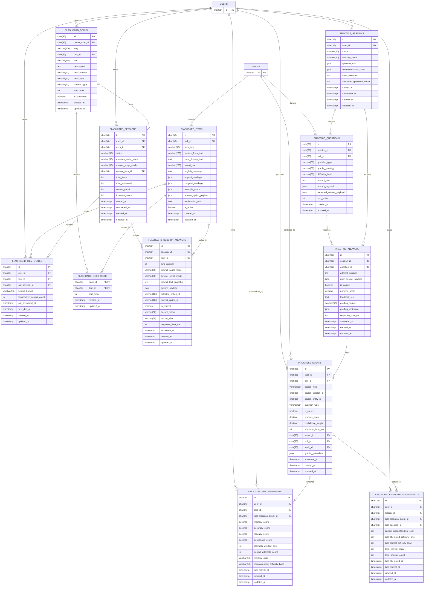

# ERD Learning Activity

## Scope
- Dokumen ini menyelesaikan task `ARCH-10`.
- Fokus utamanya mencakup tabel inti yang diminta oleh task: `flashcard_decks`, `flashcard_items`, `practice_sessions`, `practice_questions`, `practice_answers`, `progress_events`, dan `skill_mastery_snapshots`.
- Dokumen ini juga menetapkan `lesson_understanding_snapshots` sebagai tabel progress first-class untuk mencatat level pemahaman terakhir user per lesson setelah post-study quiz/review.
- Dokumen ini juga menambahkan empat supporting entity, `flashcard_deck_items`, `flashcard_sessions`, `flashcard_session_answers`, dan `flashcard_item_states`, karena custom deck by reference membutuhkan relasi many-to-many deck-item, sementara flashcard multiple-choice yang membentuk opsi jawaban saat session dibuat, lalu menyimpan snapshot opsi yang benar-benar ditampilkan, tidak bisa dimodelkan dengan aman tanpa state per session, answer log per turn, dan state per user-per-item.
- Relasi ke `users`, `skills`, `lessons`, `units`, `tracks`, dan `lesson_post_study_questions` diperlakukan sebagai external references dari ERD `ARCH-08` dan `ARCH-09`.

## Design Goals
- Menjaga ownership data tetap sesuai boundary module: `flashcards` dan `practice` menyimpan hasil internalnya sendiri lebih dulu, lalu `progress` menerima handoff event terstruktur.
- Menyediakan model persistence yang cukup untuk deterministic flashcard grading, AI-assisted random practice grading, direct lesson post-study quiz grading, dan recompute mastery snapshot secara write-through.
- Menjaga atribusi `user -> skill -> learning event -> mastery snapshot` tetap stabil untuk dashboard, recommendation, dan future analytics.
- Menjaga random practice tetap berbasis `practice_sessions`, sementara lesson `post-study quiz` deterministik tidak membuat `practice_session`/`practice_question`; quiz ini memilih tepat `1` soal dari bank lesson setelah learner selesai membaca materi.
- Mendukung deck bawaan sistem sekaligus custom deck milik user tanpa memaksa keduanya memakai perilaku katalog yang sama.
- Memungkinkan satu `flashcard_item` direuse oleh banyak deck, termasuk custom deck yang dibentuk user dari item bank yang sudah ada.
- Mengunci scope MVP flashcard ke `KANJI`, `KANA`, dan `VOCABULARY`, sehingga model data tetap cukup spesifik untuk karakter tunggal maupun kosakata pendek tanpa keluar dari evaluasi deterministic multiple-choice.
- Memastikan pilihan `question_script_mode` dan `answer_script_mode` dipilih sebelum session dimulai lalu dikunci selama session aktif agar evaluasi, opsi jawaban, dan progress attribution tetap konsisten.

## Entity Relationship Diagram


```mermaid
erDiagram
    USERS ||--o{ FLASHCARD_DECKS : owns
    USERS ||--o{ FLASHCARD_SESSIONS : starts
    USERS ||--o{ FLASHCARD_ITEM_STATES : owns
    USERS ||--o{ PRACTICE_SESSIONS : starts
    USERS ||--o{ PROGRESS_EVENTS : produces
    USERS ||--o{ SKILL_MASTERY_SNAPSHOTS : owns
    USERS ||--o{ LESSON_UNDERSTANDING_SNAPSHOTS : owns

    SKILLS ||--o{ FLASHCARD_ITEMS : targets
    SKILLS ||--o{ PRACTICE_QUESTIONS : targets
    SKILLS ||--o{ PROGRESS_EVENTS : attributed_to
    SKILLS ||--o{ SKILL_MASTERY_SNAPSHOTS : summarized_by

    FLASHCARD_DECKS ||--o{ FLASHCARD_DECK_ITEMS : contains
    FLASHCARD_ITEMS ||--o{ FLASHCARD_DECK_ITEMS : reused_in
    FLASHCARD_DECKS ||--o{ FLASHCARD_SESSIONS : runs
    FLASHCARD_SESSIONS ||--o{ FLASHCARD_SESSION_ANSWERS : records
    FLASHCARD_ITEMS ||--o{ FLASHCARD_SESSION_ANSWERS : asked_in
    FLASHCARD_ITEMS ||--o{ FLASHCARD_ITEM_STATES : tracks
    FLASHCARD_SESSIONS ||--o{ FLASHCARD_ITEM_STATES : updates

    PRACTICE_SESSIONS ||--o{ PRACTICE_QUESTIONS : contains
    PRACTICE_QUESTIONS ||--o{ PRACTICE_ANSWERS : receives
    PRACTICE_SESSIONS ||--o{ PRACTICE_ANSWERS : records
    PRACTICE_ANSWERS ||--o{ PROGRESS_EVENTS : emits
    PROGRESS_EVENTS ||--o{ SKILL_MASTERY_SNAPSHOTS : refreshes
    PROGRESS_EVENTS ||--o{ LESSON_UNDERSTANDING_SNAPSHOTS : refreshes

    USERS {
        char(36) id PK
    }

    SKILLS {
        char(36) id PK
    }

    FLASHCARD_DECKS {
        char(36) id PK
        char(36) owner_user_id FK
        varchar(100) slug
        char(36) unit_id FK
        varchar(255) title
        text description
        varchar(50) deck_source
        varchar(50) deck_type
        varchar(50) content_type
        int sort_order
        boolean is_published
        timestamp created_at
        timestamp updated_at
    }

    FLASHCARD_ITEMS {
        char(36) id PK
        char(36) skill_id FK
        varchar(50) item_type
        varchar(255) surface_form_text
        text kana_display_text
        varchar(255) romaji_text
        text english_meaning
        json onyomi_readings
        json kunyomi_readings
        json example_words
        json answer_option_payload
        text explanation_text
        boolean is_active
        timestamp created_at
        timestamp updated_at
    }

    FLASHCARD_DECK_ITEMS {
        char(36) deck_id PK, FK
        char(36) item_id PK, FK
        int sort_order
        timestamp created_at
        timestamp updated_at
    }

    FLASHCARD_SESSIONS {
        char(36) id PK
        char(36) user_id FK
        char(36) deck_id FK
        varchar(50) status
        varchar(50) question_script_mode
        varchar(50) answer_script_mode
        char(36) current_item_id FK
        int total_items
        int total_answered
        int correct_count
        int incorrect_count
        timestamp started_at
        timestamp completed_at
        timestamp created_at
        timestamp updated_at
    }

    FLASHCARD_SESSION_ANSWERS {
        char(36) id PK
        char(36) session_id FK
        char(36) item_id FK
        int turn_number
        varchar(50) prompt_script_mode
        varchar(50) answer_script_mode
        text prompt_text_snapshot
        json options_payload
        varchar(100) selected_option_id
        varchar(100) correct_option_id
        boolean is_correct
        varchar(50) bucket_before
        varchar(50) bucket_after
        int response_time_ms
        timestamp answered_at
        timestamp created_at
        timestamp updated_at
    }

    FLASHCARD_ITEM_STATES {
        char(36) id PK
        char(36) user_id FK
        char(36) item_id FK
        char(36) last_session_id FK
        varchar(50) current_bucket
        int consecutive_correct_count
        timestamp last_answered_at
        timestamp next_due_at
        timestamp created_at
        timestamp updated_at
    }

    PRACTICE_SESSIONS {
        char(36) id PK
        char(36) user_id FK
        varchar(50) status
        varchar(50) difficulty_band
        json question_mix
        json recommendation_spec
        int total_questions
        int answered_questions_count
        timestamp started_at
        timestamp completed_at
        timestamp created_at
        timestamp updated_at
    }

    PRACTICE_QUESTIONS {
        char(36) id PK
        char(36) session_id FK
        char(36) skill_id FK
        varchar(50) question_type
        varchar(50) grading_strategy
        varchar(50) difficulty_band
        text prompt_text
        json prompt_payload
        json expected_answer_payload
        int sort_order
        timestamp created_at
        timestamp updated_at
    }

    PRACTICE_ANSWERS {
        char(36) id PK
        char(36) session_id FK
        char(36) question_id FK
        int attempt_number
        json user_answer_payload
        boolean is_correct
        decimal numeric_score
        text feedback_text
        varchar(50) grading_source
        json grading_metadata
        int response_time_ms
        timestamp answered_at
        timestamp created_at
        timestamp updated_at
    }

    PROGRESS_EVENTS {
        char(36) id PK
        char(36) user_id FK
        char(36) skill_id FK
        varchar(50) source_type
        char(36) source_session_id
        char(36) source_entity_id
        varchar(50) question_type
        boolean is_correct
        decimal numeric_score
        decimal confidence_weight
        int response_time_ms
        char(36) lesson_id FK
        char(36) unit_id FK
        char(36) track_id FK
        json grading_metadata
        timestamp answered_at
        timestamp created_at
        timestamp updated_at
    }

    SKILL_MASTERY_SNAPSHOTS {
        char(36) id PK
        char(36) user_id FK
        char(36) skill_id FK
        char(36) last_progress_event_id FK
        decimal mastery_score
        decimal accuracy_score
        decimal recency_score
        decimal confidence_score
        int attempts_window_size
        int correct_attempts_count
        varchar(50) mastery_state
        varchar(50) recommended_difficulty_band
        timestamp last_activity_at
        timestamp created_at
        timestamp updated_at
    }

    LESSON_UNDERSTANDING_SNAPSHOTS {
        char(36) id PK
        char(36) user_id FK
        char(36) lesson_id FK
        char(36) last_progress_event_id FK
        char(36) last_question_id FK
        int current_understanding_level
        int last_attempted_difficulty_level
        int last_correct_difficulty_level
        int total_correct_count
        int total_attempt_count
        timestamp last_attempted_at
        timestamp last_correct_at
        timestamp created_at
        timestamp updated_at
    }
```

## Relationship Notes
- `flashcard_decks 1 -> N flashcard_deck_items`: satu deck memiliki daftar membership item yang terurut.
- `flashcard_items 1 -> N flashcard_deck_items`: satu item bisa direuse oleh banyak deck, termasuk deck bawaan sistem dan custom deck user.
- `flashcard_decks 1 -> N flashcard_sessions`: satu user bisa membuka banyak session untuk deck yang sama di waktu berbeda.
- `flashcard_sessions 1 -> N flashcard_session_answers`: setiap jawaban item di session dicatat sebagai turn terpisah agar opsi yang ditampilkan, pilihan user, dan hasil bucket update dapat diaudit ulang.
- `flashcard_items 1 -> N flashcard_item_states`: state Leitner disimpan per `user + item`, bukan di tabel item global.
- `practice_sessions 1 -> N practice_questions`: satu session practice menghasilkan satu set pertanyaan untuk random practice. Lesson `post-study quiz` tidak memakai relasi ini pada baseline MVP.
- `practice_questions 1 -> N practice_answers`: MVP bisa memakai satu answer per question, tetapi relasi dibuat `1 -> N` agar retry/future replay tidak mematahkan schema.
- `practice_answers 1 -> N progress_events`: satu jawaban practice minimal menghasilkan satu event, tetapi model ini tetap aman bila nanti ada pemecahan event granular.
- `progress_events 1 -> N lesson_understanding_snapshots`: event benar/salah dari lesson `post-study quiz` mengubah snapshot pemahaman terakhir per `user + lesson`.
- `users 1 -> N progress_events` dan `users 1 -> N skill_mastery_snapshots`: progress selalu dihitung per user.
- `skills 1 -> N progress_events` dan `skills 1 -> N skill_mastery_snapshots`: skill adalah level terkecil yang diatribusikan dan diringkas oleh domain `progress`.
- `users 1 -> N flashcard_decks`: satu user bisa memiliki banyak custom deck; deck bawaan sistem memakai `owner_user_id = null`.

## Table Definitions

### `flashcard_decks`
Katalog deck flashcard yang dibaca user sebelum memulai session.

| Column | Type | Constraint | Notes |
| --- | --- | --- | --- |
| `id` | `char(36)` | PK | Internal deck id. |
| `owner_user_id` | `char(36)` | FK -> `users.id`, null | `null` untuk deck bawaan sistem; terisi untuk custom deck milik user tertentu. |
| `slug` | `varchar(100)` | null | Identifier stabil untuk deck bawaan sistem. Pada custom deck bisa `null` atau generated slug internal. |
| `unit_id` | `char(36)` | FK -> `units.id`, null | Scope utama deck ke unit syllabus; nullable untuk deck lintas unit. |
| `title` | `varchar(255)` | not null | Nama deck. |
| `description` | `text` | null | Ringkasan isi deck. |
| `deck_source` | `varchar(50)` | not null | Mis. `SYSTEM`, `CUSTOM`. |
| `deck_type` | `varchar(50)` | not null | Mis. `REVIEW`, `FOUNDATION`, `WEAK_SKILL`. |
| `content_type` | `varchar(50)` | not null | Scope deck MVP: `KANJI`, `KANA`, atau `VOCABULARY`. Satu deck tidak boleh mencampur keluarga konten agar mode script session tetap sederhana dan konsisten. |
| `sort_order` | `int` | not null | Urutan deck di list UI. |
| `is_published` | `boolean` | not null default `false` | Gate visibility di katalog umum. Custom deck tetap bisa terlihat oleh owner walau tidak dipublish global. |
| `created_at` | `timestamp` | not null | Audit create time. |
| `updated_at` | `timestamp` | not null | Audit update time. |

Recommended constraints:
- unique index `flashcard_decks_slug_uk` pada `slug` bila `slug` dipakai
- index `flashcard_decks_owner_idx` pada `owner_user_id`
- index `flashcard_decks_source_idx` pada `deck_source`
- unique composite `(`unit_id`, `sort_order`)` bila deck memang diurutkan per unit

### `flashcard_items`
Item konten flashcard reusable yang menjadi basis evaluasi deterministik untuk latihan karakter tunggal maupun kosakata pendek.

| Column | Type | Constraint | Notes |
| --- | --- | --- | --- |
| `id` | `char(36)` | PK | Internal flashcard item id. |
| `skill_id` | `char(36)` | FK -> `skills.id`, null | Skill utama yang diukur item ini bila item bisa dipetakan ke katalog syllabus resmi. |
| `item_type` | `varchar(50)` | not null | Dikunci ke `KANJI_CHARACTER`, `HIRAGANA_CHARACTER`, `KATAKANA_CHARACTER`, atau `VOCABULARY`. |
| `surface_form_text` | `varchar(255)` | not null | Teks utama item pada mode prompt permukaan, mis. `日`, `あ`, `ア`, `学校`, atau `食べる`. |
| `kana_display_text` | `text` | null | Teks kana canonical untuk mode tanya/jawab `KANA`. Pada item kanji biasanya berupa gabungan display onyomi/kunyomi, pada item kana biasanya sama dengan `surface_form_text`, dan pada item vocabulary biasanya berisi reading kana utama. |
| `romaji_text` | `varchar(255)` | null | Padanan romaji untuk item yang mendukung mode `ROMAJI`. Wajib terisi bila `item_type` adalah `HIRAGANA_CHARACTER`, `KATAKANA_CHARACTER`, atau vocabulary yang ingin bisa ditanya/dijawab via romaji. |
| `english_meaning` | `text` | null | Arti bahasa Inggris utama. Wajib terisi untuk item kanji dan vocabulary pada scope MVP ini. |
| `onyomi_readings` | `json` | null | Array kana reading onyomi untuk item kanji. |
| `kunyomi_readings` | `json` | null | Array kana reading kunyomi untuk item kanji. |
| `example_words` | `json` | null | Array objek contoh kata atau contoh pemakaian ringkas. Pada item kanji bisa berupa contoh kata seperti `[{\"word\":\"日本\",\"kana\":\"にほん\",\"meaning\":\"Japan\"}]`; pada vocabulary boleh dipakai untuk contoh penggunaan bila memang diperlukan. |
| `answer_option_payload` | `json` | not null | Seed canonical answer dan distractor pool per script mode. Bukan empat opsi final yang selalu tetap; backend membentuk opsi final saat session dibuat. |
| `explanation_text` | `text` | null | Narasi singkat opsional di luar field feedback terstruktur. |
| `is_active` | `boolean` | not null default `true` | Menandai item masih dipakai sistem. |
| `created_at` | `timestamp` | not null | Audit create time. |
| `updated_at` | `timestamp` | not null | Audit update time. |

Recommended constraints:
- index `flashcard_items_skill_id_idx` pada `skill_id`

### `flashcard_deck_items`
Tabel penghubung yang memetakan item ke deck secara many-to-many.

| Column | Type | Constraint | Notes |
| --- | --- | --- | --- |
| `deck_id` | `char(36)` | PK, FK -> `flashcard_decks.id`, not null | Deck owner dari membership ini. |
| `item_id` | `char(36)` | PK, FK -> `flashcard_items.id`, not null | Item reusable yang dimasukkan ke deck. |
| `sort_order` | `int` | not null | Urutan item di deck tertentu. |
| `created_at` | `timestamp` | not null | Audit create time. |
| `updated_at` | `timestamp` | not null | Audit update time. |

Recommended constraints:
- unique composite `(`deck_id`, `sort_order`)`
- index `flashcard_deck_items_item_idx` pada `item_id`

### Flashcard Scope Clarification
- Scope MVP `flashcard_items` sekarang mencakup karakter tunggal `KANJI`, `HIRAGANA`, `KATAKANA`, dan item `VOCABULARY`.
- Item kanji membawa data untuk tiga mode tampilan: `KANJI`, `KANA`, dan `ENGLISH`.
- Item kana membawa data untuk dua mode tampilan: `KANA` dan `ROMAJI`.
- Item vocabulary minimal membawa data untuk prompt `JAPANESE` dan `ENGLISH`, dengan `KANA` sebagai reading support atau bentuk jawaban alternatif saat diperlukan.
- Evaluasi jawaban tidak lagi memakai free-text. `answer_option_payload` berperan sebagai seed canonical answer dan distractor pool, sedangkan snapshot opsi final yang benar-benar dilihat user disimpan pada `flashcard_session_answers`.
- Opsi jawaban final dibentuk saat session dibuat berdasarkan `question_script_mode`, `answer_script_mode`, dan item yang dibawa ke session, lalu dipakai konsisten selama session tersebut berjalan.
- Dengan model ini, tingkat kesulitan tidak terkunci pada empat opsi yang selalu sama, tetapi grading tetap deterministic karena turn answer hanya menilai terhadap snapshot opsi yang sudah dibentuk sebelumnya.
- Distractor pool adalah kumpulan kandidat jawaban salah yang masih plausibel untuk satu item dan satu script mode. Contoh: item kanji `日` dengan mode jawaban `ENGLISH` bisa memiliki distractor pool seperti `month / moon`, `fire`, `tree`, sedangkan item vocabulary `学校` bisa memiliki distractor pool seperti `teacher`, `library`, `station`, lalu session builder memilih sebagian kandidat yang paling cocok untuk turn tersebut.
- `flashcard_decks` mendukung dua sumber:
  - deck bawaan sistem, mis. `Flashcard Kanji JLPT N5 Part 1`
  - custom deck milik user, berisi referensi ke item yang mereka pilih dari item bank yang sudah ada
- Untuk menjaga UX dan validasi session tetap sederhana, satu deck hanya boleh berisi item dengan `content_type` yang sama.
- `flashcard_deck_items` adalah source of truth untuk membership item ke deck dan urutan item di dalam deck.
- Item yang direuse oleh custom deck tetap mempertahankan `skill_id` bawaan item tersebut bila memang ada pemetaan ke katalog syllabus resmi.
- Jika ada item di item bank yang tidak punya pemetaan ke `skill` resmi, item itu tetap valid untuk latihan pribadi di module `flashcards`, tetapi tidak menjadi kandidat ideal untuk handoff `progress` yang membutuhkan attribution resmi ke `skill -> lesson -> unit -> track`.

### `flashcard_sessions`
Representasi satu run user ketika mengerjakan deck flashcard.

| Column | Type | Constraint | Notes |
| --- | --- | --- | --- |
| `id` | `char(36)` | PK | Internal session id. |
| `user_id` | `char(36)` | FK -> `users.id`, not null | Owner session. |
| `deck_id` | `char(36)` | FK -> `flashcard_decks.id`, not null | Deck yang dikerjakan. |
| `status` | `varchar(50)` | not null | Mis. `ACTIVE`, `COMPLETED`, `ABANDONED`. |
| `question_script_mode` | `varchar(50)` | not null | Untuk deck `KANJI`: `KANJI`, `KANA`, atau `ENGLISH`. Untuk deck `KANA`: `KANA` atau `ROMAJI`. Untuk deck `VOCABULARY`: `JAPANESE` atau `ENGLISH`. Dipilih sebelum session dimulai lalu dikunci selama session aktif. |
| `answer_script_mode` | `varchar(50)` | not null | Pasangan mode jawaban yang valid untuk `question_script_mode` pada deck tersebut. |
| `current_item_id` | `char(36)` | FK -> `flashcard_items.id`, null | Pointer item yang sedang/terakhir dikerjakan. Opsi final untuk item pertama juga dibentuk saat session dibuat. |
| `total_items` | `int` | not null | Total item yang dibawa ke session ini, mis. `10` item terurut dari deck. |
| `total_answered` | `int` | not null default `0` | Total jawaban dalam session ini. |
| `correct_count` | `int` | not null default `0` | Counter jawaban benar. |
| `incorrect_count` | `int` | not null default `0` | Counter jawaban salah. |
| `started_at` | `timestamp` | not null | Waktu session dimulai. |
| `completed_at` | `timestamp` | null | Waktu session selesai. |
| `created_at` | `timestamp` | not null | Audit create time. |
| `updated_at` | `timestamp` | not null | Audit update time. |

Recommended constraints:
- index `flashcard_sessions_user_status_idx` pada `user_id, status`
- index `flashcard_sessions_deck_id_idx` pada `deck_id`

### `flashcard_session_answers`
Log setiap turn jawaban pada session flashcard.

| Column | Type | Constraint | Notes |
| --- | --- | --- | --- |
| `id` | `char(36)` | PK | Internal answer-turn id. |
| `session_id` | `char(36)` | FK -> `flashcard_sessions.id`, not null | Parent session. |
| `item_id` | `char(36)` | FK -> `flashcard_items.id`, not null | Item yang ditanyakan pada turn ini. |
| `turn_number` | `int` | not null | Urutan turn di dalam session. |
| `prompt_script_mode` | `varchar(50)` | not null | Snapshot mode pertanyaan saat item ditampilkan. |
| `answer_script_mode` | `varchar(50)` | not null | Snapshot mode jawaban saat opsi dirender. |
| `prompt_text_snapshot` | `text` | not null | Nilai prompt final yang dilihat user, mis. `日`, `にち・ひ`, atau `sun/day`. |
| `options_payload` | `json` | not null | Snapshot opsi final yang benar-benar ditampilkan ke user pada turn ini; dibentuk dari distractor pool saat session dibuat atau saat item berikutnya dipersiapkan sebelum render. |
| `selected_option_id` | `varchar(100)` | not null | Identifier opsi yang dipilih user. |
| `correct_option_id` | `varchar(100)` | not null | Identifier opsi yang seharusnya benar pada turn ini. |
| `is_correct` | `boolean` | not null | Outcome deterministic untuk turn ini. |
| `bucket_before` | `varchar(50)` | not null | Bucket item state sebelum jawaban diproses. |
| `bucket_after` | `varchar(50)` | not null | Bucket item state setelah jawaban diproses. |
| `response_time_ms` | `int` | null | Lama waktu user menjawab untuk turn ini. |
| `answered_at` | `timestamp` | not null | Waktu submit jawaban. |
| `created_at` | `timestamp` | not null | Audit create time. |
| `updated_at` | `timestamp` | not null | Audit update time. |

Recommended constraints:
- unique composite `(`session_id`, `turn_number`)`
- index `flashcard_session_answers_item_idx` pada `item_id`
- index `flashcard_session_answers_answered_at_idx` pada `answered_at`

### `flashcard_item_states`
State Leitner bucket per user-per-item yang dimiliki module `flashcards`.

| Column | Type | Constraint | Notes |
| --- | --- | --- | --- |
| `id` | `char(36)` | PK | Internal item-state id. |
| `user_id` | `char(36)` | FK -> `users.id`, not null | Owner state. |
| `item_id` | `char(36)` | FK -> `flashcard_items.id`, not null | Item yang di-track. |
| `last_session_id` | `char(36)` | FK -> `flashcard_sessions.id`, null | Session terakhir yang mengubah bucket ini. |
| `current_bucket` | `varchar(50)` | not null | Bucket Leitner MVP: `NEW`, `LEARNING`, `MASTERED`. |
| `consecutive_correct_count` | `int` | not null default `0` | Membantu rule promote/demote ringan. |
| `last_answered_at` | `timestamp` | null | Waktu jawaban terakhir untuk item ini. |
| `next_due_at` | `timestamp` | null | Kapan item berikutnya layak dimunculkan lagi. |
| `created_at` | `timestamp` | not null | Audit create time. |
| `updated_at` | `timestamp` | not null | Audit update time. |

Recommended constraints:
- unique composite `(`user_id`, `item_id`)`
- index `flashcard_item_states_user_due_idx` pada `user_id, next_due_at`

### `practice_sessions`
Representasi satu sesi practice generation untuk satu user.

| Column | Type | Constraint | Notes |
| --- | --- | --- | --- |
| `id` | `char(36)` | PK | Internal practice session id. |
| `user_id` | `char(36)` | FK -> `users.id`, not null | Owner session. |
| `status` | `varchar(50)` | not null | Mis. `GENERATED`, `IN_PROGRESS`, `COMPLETED`, `EXPIRED`. |
| `difficulty_band` | `varchar(50)` | null | Band kategorikal default untuk random practice, disarankan berupa enum-like string seperti `REMEDIAL`, `STANDARD`, `STRETCH`. |
| `question_mix` | `json` | null | Komposisi session dalam bentuk distribution JSON, mis. `{\"WEAK\":0.6,\"REINFORCEMENT\":0.3,\"STRETCH\":0.1}`. Relevan untuk random practice. |
| `recommendation_spec` | `json` | null | Snapshot input rekomendasi saat session dibuat. Relevan untuk random practice dan harus boleh membawa `lesson_understanding_levels` sebagai faktor tambahan. |
| `total_questions` | `int` | not null | Default MVP: `5`. |
| `answered_questions_count` | `int` | not null default `0` | Counter progress session. |
| `started_at` | `timestamp` | not null | Waktu session dimulai/digenerate. |
| `completed_at` | `timestamp` | null | Waktu session selesai. |
| `created_at` | `timestamp` | not null | Audit create time. |
| `updated_at` | `timestamp` | not null | Audit update time. |

Recommended constraints:
- index `practice_sessions_user_status_idx` pada `user_id, status`
- index `practice_sessions_started_at_idx` pada `started_at`

### `practice_questions`
Kumpulan soal yang tergenerate di dalam satu practice session.

| Column | Type | Constraint | Notes |
| --- | --- | --- | --- |
| `id` | `char(36)` | PK | Internal question id. |
| `session_id` | `char(36)` | FK -> `practice_sessions.id`, not null | Parent session. |
| `skill_id` | `char(36)` | FK -> `skills.id`, not null | Skill utama yang diukur question ini. |
| `question_type` | `varchar(50)` | not null | Mis. `SHORT_FREE_RESPONSE`, `SLOT_FILL`, `ARRANGE_TOKEN`, `FREE_RESPONSE`. |
| `grading_strategy` | `varchar(50)` | not null | Mis. `DETERMINISTIC`, `AI`. Untuk `FREE_RESPONSE`, default MVP adalah `AI`. |
| `difficulty_band` | `varchar(50)` | null | Band kategorikal final per soal random practice. |
| `prompt_text` | `text` | not null | Prompt utama yang dirender ke UI. |
| `prompt_payload` | `json` | null | Payload terstruktur untuk opsi, stimulus, atau media. |
| `expected_answer_payload` | `json` | null | Kunci jawaban atau grading rubric minimum. |
| `sort_order` | `int` | not null | Urutan soal di dalam session. |
| `created_at` | `timestamp` | not null | Audit create time. |
| `updated_at` | `timestamp` | not null | Audit update time. |

Recommended constraints:
- unique composite `(`session_id`, `sort_order`)`
- index `practice_questions_skill_id_idx` pada `skill_id`

### Practice Grading Clarification
- `grading_strategy` bergantung pada `question_type`.
- Untuk question type yang deterministik seperti `SHORT_FREE_RESPONSE`, `SLOT_FILL`, dan `ARRANGE_TOKEN`, default strategy adalah `DETERMINISTIC`.
- Untuk `question_type = FREE_RESPONSE`, default MVP dikunci ke `grading_strategy = AI`.
- Artinya pada MVP, jawaban free-response penuh dinilai oleh AI provider, lalu hasil terstrukturnya disimpan ke `practice_answers` dan diteruskan ke `progress`.
- Lesson `post-study quiz` tidak membuat `practice_question`; grading deterministiknya berjalan langsung dari template `lesson_post_study_questions`.
- Jika nanti ada rubric deterministic untuk sebagian free-response tertentu, itu dianggap evolusi setelah MVP, bukan baseline desain saat ini.

### Practice Question Type Clarification
- `practice` MVP tidak lagi memakai `MULTIPLE_CHOICE` karena pola pilihan ganda sudah dicakup oleh activity `flashcards`.
- Jika recommendation spec tidak menyuplai `allowed_question_types` atau hasilnya kosong, fallback default question type untuk random practice adalah `SHORT_FREE_RESPONSE`.
- `SHORT_FREE_RESPONSE` dipakai untuk soal kalimat dengan satu slot kosong yang diisi lewat jawaban bebas singkat bahasa Jepang.
- Pada `SHORT_FREE_RESPONSE`, UI menerima input romaji user lalu menjalankan transform ke kana sebelum jawaban final disubmit ke backend.
- `SLOT_FILL` dipakai untuk soal kalimat dengan satu slot hilang yang harus diisi dari tepat empat opsi jawaban.
- Pada `SLOT_FILL`, prompt utama berbentuk kalimat bahasa Jepang dengan satu slot kosong, dan seluruh opsi jawaban juga dalam bahasa Jepang.
- `ARRANGE_TOKEN` dipakai untuk soal menyusun token/kata menjadi jawaban akhir yang benar.
- `ARRANGE_TOKEN` boleh dipakai untuk arah `EN_TO_JA` maupun `JA_TO_EN`.
- `FREE_RESPONSE` dipakai untuk soal menerjemahkan satu kalimat bahasa Inggris penuh ke kalimat bahasa Jepang penuh lewat jawaban bebas.
- Pada `FREE_RESPONSE`, UI menerima input romaji user lalu menjalankan transform ke kana sebelum jawaban final disubmit ke backend.
- Lesson `post-study quiz` bukan bagian dari `practice_questions`; bank soal baseline dikurasi di `syllabus.lesson_post_study_questions` sebagai `10` soal `SHORT_FREE_RESPONSE` dengan difficulty `1..10`.

Recommended shape minimum untuk `practice_questions.prompt_payload` per question type:

#### `SHORT_FREE_RESPONSE`
```json
{
  "schemaVersion": 1,
  "promptLanguage": "JA",
  "answerLanguage": "JA",
  "slotCount": 1,
  "sentenceTemplate": "わたし___がくせいです。",
  "sentenceTemplateHtml": "<p>わたし<span class=\"question-blank\">___</span>がくせいです。</p>",
  "blankInputMode": "ROMAJI_TO_KANA",
  "placeholder": "Answer here",
  "inputMethod": {
    "acceptsRomaji": true,
    "transformsTo": "KANA"
  }
}
```

#### `SLOT_FILL`
```json
{
  "schemaVersion": 1,
  "promptLanguage": "JA",
  "optionLanguage": "JA",
  "slotCount": 1,
  "sentenceTemplate": "わたし___がくせいです。",
  "options": [
    { "id": "a", "label": "は" },
    { "id": "b", "label": "が" },
    { "id": "c", "label": "を" },
    { "id": "d", "label": "に" }
  ]
}
```

#### `ARRANGE_TOKEN`
```json
{
  "schemaVersion": 1,
  "promptLanguage": "EN",
  "answerLanguage": "JA",
  "direction": "EN_TO_JA",
  "sourceSentence": "I am a student.",
  "arrangeTokens": [
    { "id": "t1", "label": "わたし" },
    { "id": "t2", "label": "は" },
    { "id": "t3", "label": "がくせい" },
    { "id": "t4", "label": "です" }
  ]
}
```

#### `FREE_RESPONSE`
```json
{
  "schemaVersion": 1,
  "promptLanguage": "EN",
  "answerLanguage": "JA",
  "sourceSentence": "I am a student.",
  "inputMethod": {
    "acceptsRomaji": true,
    "transformsTo": "KANA"
  }
}
```

Recommended shape minimum untuk `practice_questions.expected_answer_payload` per question type:

#### `SHORT_FREE_RESPONSE`
```json
{
  "schemaVersion": 1,
  "acceptedTextAnswers": ["は"],
  "normalizationProfile": "kana-strict-v1"
}
```

#### `SLOT_FILL`
```json
{
  "schemaVersion": 1,
  "acceptedOptionIds": ["a"],
  "normalizationProfile": "option-id-exact-v1"
}
```

#### `ARRANGE_TOKEN`
```json
{
  "schemaVersion": 1,
  "acceptedTokenSequences": [["t1", "t2", "t3", "t4"]],
  "normalizationProfile": "token-order-exact-v1"
}
```

#### `FREE_RESPONSE`
```json
{
  "schemaVersion": 1,
  "referenceAnswers": ["わたしはがくせいです。", "私は学生です。"],
  "acceptedTextAnswers": ["わたしはがくせいです", "私は学生です"],
  "rubricVersion": "practice-free-response-v1"
}
```

Panduan isi field:
- `acceptedTextAnswers` dipakai untuk `SHORT_FREE_RESPONSE` dan boleh juga dipakai sebagai normalization anchor untuk `FREE_RESPONSE`.
- `acceptedOptionIds` dipakai untuk `SLOT_FILL`.
- `acceptedTokenSequences` dipakai untuk `ARRANGE_TOKEN`.
- `referenceAnswers` dipakai untuk `FREE_RESPONSE` sebagai jawaban acuan utama.
- `rubricVersion` dipakai saat question membutuhkan grading rubric berbasis AI, terutama untuk `FREE_RESPONSE`.

### `practice_answers`
Jawaban user terhadap question di `practice`, termasuk hasil grading dan feedback.

| Column | Type | Constraint | Notes |
| --- | --- | --- | --- |
| `id` | `char(36)` | PK | Internal practice answer id. |
| `session_id` | `char(36)` | FK -> `practice_sessions.id`, not null | Denormalisasi ringan untuk query session summary. |
| `question_id` | `char(36)` | FK -> `practice_questions.id`, not null | Question yang dijawab. |
| `attempt_number` | `int` | not null default `1` | Aman untuk future retry tanpa ubah schema. |
| `user_answer_payload` | `json` | not null | Jawaban mentah user, baik teks maupun pilihan terstruktur. |
| `is_correct` | `boolean` | not null | Hasil grading final. |
| `numeric_score` | `decimal(5,2)` | not null | Score normalized, mis. `0-100`. |
| `feedback_text` | `text` | null | Feedback singkat untuk UI. |
| `grading_source` | `varchar(50)` | not null | Mis. `RULE_ENGINE`, `AI_PROVIDER`. |
| `grading_metadata` | `json` | null | Metadata grading terstruktur. Untuk AI grading bisa berisi confidence, rubric/result detail, parse status, dan normalized explanation; untuk deterministic grading bisa berisi rule match summary. |
| `response_time_ms` | `int` | null | Data untuk speed/confidence proxy. |
| `answered_at` | `timestamp` | not null | Waktu submit final jawaban. |
| `created_at` | `timestamp` | not null | Audit create time. |
| `updated_at` | `timestamp` | not null | Audit update time. |

Recommended constraints:
- unique composite `(`question_id`, `attempt_number`)`
- index `practice_answers_session_id_idx` pada `session_id`
- index `practice_answers_answered_at_idx` pada `answered_at`

### Grading Metadata Clarification
- `grading_metadata` dimaksudkan sebagai JSON terstruktur, bukan blob teks bebas.
- Pada `practice_answers.grading_metadata`, payload boleh lebih kaya karena tabel ini adalah sumber detail hasil grading.
- Pada `progress_events.grading_metadata`, payload sebaiknya lebih ringkas karena tujuannya hanya untuk recompute mastery, audit ringan, dan traceability event.

Recommended shape untuk `practice_answers.grading_metadata`:

```json
{
  "schema_version": 1,
  "grading_strategy": "AI",
  "rubric_version": "practice-short-free-response-v1",
  "matched_answer_keys": ["expected_meaning"],
  "confidence_score": 0.87,
  "subscores": {
    "accuracy": 0.9,
    "completeness": 0.8,
    "language_quality": 0.85
  },
  "decision_trace": {
    "accepted": true,
    "reason": "meaning preserved"
  },
  "normalization": {
    "normalized_user_answer": "watashi wa gakusei desu",
    "normalized_expected_answer": "watashi wa gakusei desu"
  },
  "ai_context": {
    "provider": "OPENAI",
    "model": "gpt-5-mini",
    "schema_parse_success": true
  }
}
```

Recommended shape untuk `progress_events.grading_metadata`:

```json
{
  "schema_version": 1,
  "grading_strategy": "AI",
  "confidence_score": 0.87,
  "rubric_version": "practice-short-free-response-v1",
  "accepted": true,
  "normalization_applied": true
}
```

Panduan isi field:
- `schema_version`: versi payload internal agar evolusi struktur tetap aman.
- `grading_strategy`: strategi final yang dipakai saat grading.
- `rubric_version`: versi rubric atau ruleset yang dipakai saat penilaian.
- `matched_answer_keys`: cocok untuk deterministic grading agar terlihat rule mana yang match.
- `confidence_score`: skor keyakinan hasil grading, terutama berguna untuk AI grading.
- `subscores`: komponen nilai bila sistem ingin menilai lebih dari satu dimensi.
- `decision_trace`: alasan singkat kenapa jawaban diterima atau ditolak.
- `normalization`: hasil normalisasi teks sebelum grading bila proses itu dilakukan.
- `ai_context`: metadata minimum hasil grading AI yang relevan di level answer.

Prinsip pemakaian:
- `practice_answers.grading_metadata` boleh lebih lengkap karena merupakan record utama hasil grading.
- `progress_events.grading_metadata` sebaiknya hanya membawa bagian yang relevan untuk mastery engine dan audit.
- Metadata observability yang lebih detail seperti token usage, latency, retry, atau failure trace tetap berada di `ai_request_logs` dan `ai_request_attempts`, bukan dipadatkan ke `grading_metadata`.

### `progress_events`
Fakta belajar mentah yang diterima `progress` dari `flashcards` atau `practice`.

| Column | Type | Constraint | Notes |
| --- | --- | --- | --- |
| `id` | `char(36)` | PK | Internal progress event id. |
| `user_id` | `char(36)` | FK -> `users.id`, not null | Owner event. |
| `skill_id` | `char(36)` | FK -> `skills.id`, not null | Skill yang sudah divalidasi oleh `syllabus`. |
| `source_type` | `varchar(50)` | not null | Mis. `FLASHCARD`, `PRACTICE`, `LESSON_POST_STUDY`. |
| `source_session_id` | `char(36)` | null | Logical reference ke session producer: `practice_sessions.id` bila `source_type = PRACTICE`, atau `flashcard_sessions.id` bila `source_type = FLASHCARD`. Untuk direct `LESSON_POST_STUDY`, nilai ini `null`. |
| `source_entity_id` | `char(36)` | not null | Logical reference ke entity hasil producer, mis. `practice_answers.id`, `flashcard_session_answers.id`, atau `lesson_post_study_questions.id` untuk direct quiz lesson. |
| `question_type` | `varchar(50)` | not null | Menjaga konteks evaluasi di downstream analytics. |
| `is_correct` | `boolean` | not null | Outcome boolean untuk agregasi cepat. |
| `numeric_score` | `decimal(5,2)` | not null | Score normalized untuk mastery engine. |
| `confidence_weight` | `decimal(5,2)` | null | Proxy tambahan untuk confidence/speed scoring. |
| `response_time_ms` | `int` | null | Dipakai sebagai sinyal recency/speed proxy. |
| `lesson_id` | `char(36)` | FK -> `lessons.id`, not null | Attribution lesson hasil validasi `syllabus`. |
| `unit_id` | `char(36)` | FK -> `units.id`, not null | Attribution unit hasil validasi `syllabus`. |
| `track_id` | `char(36)` | FK -> `tracks.id`, not null | Attribution track hasil validasi `syllabus`. |
| `grading_metadata` | `json` | null | Snapshot grading context yang diringkas untuk recompute mastery dan audit event, biasanya turunan yang lebih kecil dari `practice_answers.grading_metadata`. |
| `answered_at` | `timestamp` | not null | Waktu event learning sebenarnya terjadi. |
| `created_at` | `timestamp` | not null | Audit create time. |
| `updated_at` | `timestamp` | not null | Audit update time. |

Recommended constraints:
- index `progress_events_user_skill_answered_idx` pada `user_id, skill_id, answered_at`
- index `progress_events_source_idx` pada `source_type, source_session_id, source_entity_id`
- index `progress_events_unit_idx` pada `user_id, unit_id, answered_at`

### `skill_mastery_snapshots`
Ringkasan state mastery terbaru per `user + skill` yang dihitung dari window event terakhir.

| Column | Type | Constraint | Notes |
| --- | --- | --- | --- |
| `id` | `char(36)` | PK | Internal snapshot id. |
| `user_id` | `char(36)` | FK -> `users.id`, not null | Owner snapshot. |
| `skill_id` | `char(36)` | FK -> `skills.id`, not null | Skill yang diringkas. |
| `last_progress_event_id` | `char(36)` | FK -> `progress_events.id`, null | Event terakhir yang memicu recompute. |
| `mastery_score` | `decimal(5,2)` | not null | Nilai final mastery `0-100`. |
| `accuracy_score` | `decimal(5,2)` | not null | Komponen accuracy dari model. |
| `recency_score` | `decimal(5,2)` | not null | Komponen recency dari model. |
| `confidence_score` | `decimal(5,2)` | not null | Komponen speed/confidence proxy dari model. |
| `attempts_window_size` | `int` | not null | Jumlah attempt yang benar-benar ikut dihitung dalam snapshot aktif. Pada MVP maksimum mengacu ke `20` attempt terakhir, tetapi bisa lebih kecil jika history user belum sebanyak itu. |
| `correct_attempts_count` | `int` | not null | Jumlah attempt benar di dalam window aktif yang sama dengan `attempts_window_size`. |
| `mastery_state` | `varchar(50)` | not null | Mis. `WEAK`, `DEVELOPING`, `STABLE`, `MASTERED`. |
| `recommended_difficulty_band` | `varchar(50)` | not null | Output band kategorikal ringkas untuk practice/personalization, mis. `REMEDIAL`, `STANDARD`, `STRETCH`. |
| `last_activity_at` | `timestamp` | null | Timestamp attempt terbaru pada skill ini. |
| `created_at` | `timestamp` | not null | Audit create time. |
| `updated_at` | `timestamp` | not null | Audit update time. |

Recommended constraints:
- unique composite `(`user_id`, `skill_id`)`
- index `skill_mastery_snapshots_user_state_idx` pada `user_id, mastery_state`
- index `skill_mastery_snapshots_difficulty_idx` pada `user_id, recommended_difficulty_band`

### `lesson_understanding_snapshots`
Ringkasan state pemahaman terbaru per `user + lesson` yang khusus berasal dari post-study quiz dan review lesson.

| Column | Type | Constraint | Notes |
| --- | --- | --- | --- |
| `id` | `char(36)` | PK | Internal lesson-understanding snapshot id. |
| `user_id` | `char(36)` | FK -> `users.id`, not null | Owner snapshot. |
| `lesson_id` | `char(36)` | FK -> `lessons.id`, not null | Lesson yang diukur pemahamannya. |
| `last_progress_event_id` | `char(36)` | FK -> `progress_events.id`, null | Event terakhir yang memicu update snapshot. |
| `last_question_id` | `char(36)` | FK logical -> `lesson_post_study_questions.id`, null | Soal bank lesson terakhir yang dijawab. |
| `current_understanding_level` | `int` | not null default `0` | Level pemahaman terakhir `0..10`. `0` berarti belum pernah menjawab benar post-study quiz lesson tersebut. |
| `last_attempted_difficulty_level` | `int` | null | Difficulty `1..10` dari attempt terakhir. |
| `last_correct_difficulty_level` | `int` | null | Difficulty `1..10` terakhir yang berhasil dijawab benar. |
| `total_correct_count` | `int` | not null default `0` | Counter benar untuk audit ringan dan UI review. |
| `total_attempt_count` | `int` | not null default `0` | Counter total attempt untuk audit ringan dan UI review. |
| `last_attempted_at` | `timestamp` | null | Waktu attempt terakhir, benar maupun salah. |
| `last_correct_at` | `timestamp` | null | Waktu jawaban benar terakhir. |
| `created_at` | `timestamp` | not null | Audit create time. |
| `updated_at` | `timestamp` | not null | Audit update time. |

Recommended constraints:
- unique composite `(`user_id`, `lesson_id`)`
- index `lesson_understanding_snapshots_user_level_idx` pada `user_id, current_understanding_level`
- index `lesson_understanding_snapshots_lesson_idx` pada `lesson_id`
- check constraint `lesson_understanding_snapshots_level_ck` untuk range `0..10`
- check constraint `lesson_understanding_snapshots_last_attempted_difficulty_ck` untuk range `1..10` bila terisi
- check constraint `lesson_understanding_snapshots_last_correct_difficulty_ck` untuk range `1..10` bila terisi

### Lesson Understanding Rule
- Initial state pemahaman user terhadap lesson adalah `0`; row boleh dibuat lazy saat quiz pertama diambil atau saat answer pertama diproses.
- Saat learner selesai membaca lesson, UI wajib mengarahkan learner ke post-study quiz dengan tepat `1` pertanyaan.
- Target difficulty untuk attempt berikutnya adalah `min(current_understanding_level + 1, 10)`.
- Jika jawaban benar, `current_understanding_level` naik satu level sampai maksimum `10`.
- Jika jawaban salah, `current_understanding_level` tidak berubah; learner boleh mencoba review lagi pada target difficulty yang sama.
- Lesson dianggap selesai untuk baseline course flow bila `current_understanding_level >= 1`.
- Review lesson tetap memakai flow yang sama setelah lesson selesai; setiap jawaban benar berikutnya menaikkan pemahaman sampai level `10`.
- `lesson_understanding_snapshots` adalah source of truth untuk ukuran pemahaman lesson, sedangkan `skill_mastery_snapshots` tetap source of truth untuk mastery per skill.
- AI random practice generation dan personalization harus menerima `lesson_understanding_snapshots` sebagai salah satu faktor konteks, terutama untuk memilih lesson reinforcement dan target difficulty yang cocok.

### Mastery Window Clarification
- `attempts_window_size` dan `correct_attempts_count` adalah ringkasan statistik dari window attempt yang dipakai saat snapshot dihitung.
- Keduanya bukan counter seumur hidup, melainkan counter untuk window aktif yang sedang dipakai mastery engine.
- Pada MVP, mastery model mengacu ke maksimal `20` attempt terakhir per skill.
- Artinya:
  - jika user sudah punya `20` attempt atau lebih untuk suatu skill, maka `attempts_window_size` biasanya bernilai `20`
  - jika user baru punya `6` attempt untuk skill itu, maka `attempts_window_size` bernilai `6`, bukan dipaksa `20`
- `correct_attempts_count` selalu dibaca dalam konteks window yang sama.
- Contoh:
  - `attempts_window_size = 20` dan `correct_attempts_count = 15` berarti dari 20 attempt terakhir untuk skill tersebut, 15 di antaranya benar
  - `attempts_window_size = 6` dan `correct_attempts_count = 4` berarti user baru punya 6 attempt relevan, dan 4 di antaranya benar
- Dua field ini terutama membantu:
  - memberi transparansi tentang ukuran sampel yang dipakai snapshot
  - memudahkan debugging saat `mastery_score` terlihat tinggi/rendah tetapi history attempt masih sedikit
  - mendukung query read model tanpa harus selalu membuka ulang seluruh `progress_events`
- `correct_attempts_count / attempts_window_size` tidak identik langsung dengan `accuracy_score`, karena `accuracy_score` masih bisa dibobotkan atau dinormalisasi oleh mastery engine.

### Difficulty Band Clarification
- `difficulty_band` dimodelkan sebagai band kategorikal berbasis recommendation policy, bukan rentang angka mentah.
- Untuk MVP, format paling aman adalah string enum-like seperti `REMEDIAL`, `STANDARD`, dan `STRETCH`.
- Nilai numerik tetap berada di `skill_mastery_snapshots.mastery_score`; `difficulty_band` adalah interpretasi orchestration yang diturunkan dari mastery, recent performance, dan recommendation context.
- `practice_sessions.difficulty_band` mewakili band default sesi saat question set digenerate.
- Pada lesson `post-study quiz`, challenge utama tidak datang dari `difficulty_band`, tetapi dari `lesson_post_study_questions.difficulty_level` yang mengikuti ladder editorial `1..10` dan level pemahaman user saat ini.
- `practice_questions.difficulty_band` mewakili band final per soal, sehingga satu session masih bisa berisi campuran soal bila komposisi `question_mix` memang meminta variasi.
- `skill_mastery_snapshots.recommended_difficulty_band` adalah output ringkas dari engine progress/personalization yang dipakai ulang oleh practice generator.
- Untuk session berikutnya, `skill_mastery_snapshots.recommended_difficulty_band` adalah acuan utama dalam membentuk `practice_sessions.difficulty_band`, terutama saat generator mengambil target skill dari snapshot mastery terbaru.
- Meski begitu, nilainya tidak harus disalin mentah 1:1; layer personalization/practice tetap boleh menyesuaikan baseline session berdasarkan kombinasi target skill, recent mistakes, recommendation policy, dan `question_mix` yang ingin dibentuk.

### Question Mix Clarification
- `question_mix` berbeda dari `difficulty_band`.
- `difficulty_band` menjawab pertanyaan: "secara umum sesi ini seberapa menantang?"
- `question_mix` menjawab pertanyaan: "slot soal di sesi ini dibagi ke kategori apa saja dan berapa porsinya?"
- Untuk MVP, `question_mix` paling masuk akal disimpan sebagai JSON distribution yang sudah resolved, misalnya `{\"WEAK\":0.6,\"REINFORCEMENT\":0.3,\"STRETCH\":0.1}`.
- Secara relasi:
  - `difficulty_band` adalah baseline/default band session
  - `question_mix` adalah aturan komposisi yang boleh membuat sebagian `practice_questions` tetap di baseline, sebagian turun ke band yang lebih ringan, atau sebagian naik ke band yang lebih menantang
- Jadi keduanya saling terkait, tetapi tidak duplikatif: `difficulty_band` adalah baseline challenge, `question_mix` adalah session composition.
- Jika input awal tidak mengirim `question_mix`, maka pada saat row `practice_sessions` dipersist, sistem sebaiknya tetap menyimpan default mix yang sudah di-resolve; jadi di database idealnya tidak ada session "tanpa question_mix".
- Lesson `post-study quiz` tidak memakai `question_mix`, karena pemilihan soal berasal langsung dari `lesson_post_study_questions` dan `lesson_understanding_snapshots`.
- Contoh interpretasi:
  - jika `practice_sessions.difficulty_band = STANDARD` dan resolved `question_mix` efektif netral, maka mayoritas atau seluruh `practice_questions` bisa tetap `STANDARD`
  - jika `practice_sessions.difficulty_band = STANDARD` dan `question_mix = {\"REINFORCEMENT\":0.7,\"STRETCH\":0.3}`, maka sebagian besar `practice_questions` biasanya tetap di `STANDARD` atau sedikit lebih ringan, sementara porsi `STRETCH` bisa naik ke `STRETCH`
- Bucket `STRETCH` pada `question_mix` adalah label komposisi/recommendation, bukan berarti semua slot dengan bucket itu harus selalu memakai label `difficulty_band = STRETCH`; tetapi dalam praktik MVP, korelasi itu wajar dan boleh dipakai sebagai default generator rule.

### Progress Source Reference Clarification
- `progress_events.source_session_id` merujuk ke id session producer bila activity memang berbasis session.
- Jika `source_type = PRACTICE`, maka `source_session_id` merujuk ke `practice_sessions.id`.
- Jika `source_type = FLASHCARD`, maka `source_session_id` merujuk ke `flashcard_sessions.id`.
- Jika `source_type = LESSON_POST_STUDY`, maka `source_session_id` bernilai `null` dan `source_entity_id` merujuk ke `lesson_post_study_questions.id`.
- `source_entity_id` merujuk ke entity hasil paling dekat yang memicu event tersebut:
  - untuk practice biasanya `practice_answers.id`
  - untuk flashcard bisa berupa state/result entity yang dipilih implementasi `flashcards`
  - untuk lesson post-study quiz berupa `lesson_post_study_questions.id`
- Karena model ini lintas module, kedua field tersebut diperlakukan sebagai logical producer references, bukan FK polymorphic database penuh.

## Ownership And Flow Mapping
- `flashcards` memiliki `flashcard_decks`, `flashcard_items`, `flashcard_sessions`, dan `flashcard_item_states`.
- `practice` memiliki `practice_sessions`, `practice_questions`, dan `practice_answers`.
- `progress` memiliki `progress_events`, `skill_mastery_snapshots`, dan `lesson_understanding_snapshots`.
- `flashcards` dan `practice` tidak menyimpan mastery langsung; keduanya hanya menulis hasil internal lalu mengirim handoff event ke `progress`.
- `flashcards` tidak menyimpan opsi final yang selalu sama di `flashcard_items`; item hanya menyimpan seed canonical answer dan distractor pool, sementara opsi final dibentuk di boundary session lalu disnapshot untuk grading.
- `progress_events` menyimpan attribution `lesson_id`, `unit_id`, dan `track_id` agar timeline, rollup, dan audit tidak perlu selalu resolve ulang tree syllabus saat query read-heavy.
- Baseline MVP belum membutuhkan tabel `lesson_completions` terpisah; status completion lesson diturunkan dari `lesson_understanding_snapshots.current_understanding_level >= 1`.
- Audit balik post-study quiz ke canonical question bank dilakukan lewat `progress_events.source_entity_id = lesson_post_study_questions.id`, bukan lewat `practice_questions`.
- Deck bawaan sistem dan custom deck user tetap berada di boundary `flashcards`; pembedanya ada pada `deck_source` dan `owner_user_id`.
- Item flashcard yang memiliki `skill_id` bisa ikut jalur handoff resmi ke `progress`.
- Item flashcard custom tanpa `skill_id` tetap sah untuk latihan pribadi, tetapi sebaiknya tidak dipakai untuk update mastery resmi sampai ada pemetaan ke skill katalog.

## Constraints And Assumptions
- Task checklist `ARCH-10` hanya menyebut tujuh tabel inti, tetapi `flashcard_sessions` dan `flashcard_item_states` ditambahkan karena rule Leitner bucket membutuhkan persistence internal di boundary `flashcards`.
- `source_session_id` dan `source_entity_id` pada `progress_events` diperlakukan sebagai logical producer references, bukan polymorphic FK database penuh, agar satu tabel event tetap bisa menerima producer dari `flashcards`, `practice`, maupun direct lesson post-study quiz.
- `practice_answers` dibuat multi-attempt friendly melalui `attempt_number`, walau MVP kemungkinan besar memakai satu jawaban final per soal.
- `flashcard_item_states.current_bucket` menggunakan bucket MVP `NEW`, `LEARNING`, `MASTERED`; bila nanti spacing rule makin kompleks, detail tambahan bisa ditambah tanpa mengubah relasi utama.
- `flashcard_items` sengaja dibuat generic agar bisa menampung karakter tunggal, kosakata, frasa, sampai pola kalimat pendek selama format evaluasinya masih cocok untuk flashcard.
- Custom flashcard deck dianggap masuk scope desain data; sharing atau marketplace custom deck belum dimodelkan sebagai requirement inti.
- Rollup summary per unit/track belum dibuat sebagai tabel source of truth terpisah; untuk MVP, completion lesson diturunkan dari `lesson_understanding_snapshots`, sementara ringkasan mastery tetap diturunkan dari `progress_events` dan `skill_mastery_snapshots`.

## Out Of Scope For This ERD
- AI observability log seperti request id, model, token usage, dan failure reason; itu masuk task `ARCH-11`.
- Content bank mentah untuk prompt template AI atau rubric library terpisah.
- Dashboard read model/materialized view khusus analytics; bila nanti diperlukan, itu sebaiknya diperlakukan sebagai read model turunan, bukan core transactional table.
