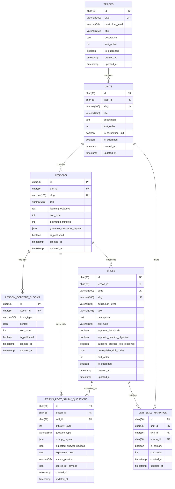

# ERD Syllabus Domain

## Scope
- Dokumen ini menyelesaikan task `ARCH-09`.
- Fokus ERD kini mencakup tujuh entitas inti domain `syllabus`: `tracks`, `units`, `lessons`, `lesson_content_blocks`, `lesson_post_study_questions`, `skills`, dan `unit_skill_mappings`, ditambah payload lesson-level untuk `grammarStructures`.
- Model ini mengikuti keputusan arsitektur bahwa `syllabus` adalah source of truth untuk struktur `track -> unit -> lesson -> skill`, validasi `skill_id` lintas module, dan bank soal lesson yang dikurasi.

## Design Goals
- Menjaga hirarki kurikulum tetap jelas untuk kebutuhan navigation, onboarding, progress attribution, dan practice generation.
- Mendukung syllabus yang read-only dan seeded from repo pada MVP, tetapi tetap siap diekstensi untuk level `N3 -> N2`.
- Menyediakan metadata skill yang cukup untuk dipakai oleh `progress`, `personalization`, `flashcards`, dan `practice` tanpa membuat module lain membuat katalog sendiri.
- Menyediakan tempat first-class untuk blok materi lesson di level `lesson` tanpa mencampur narasi belajar ke field summary seperti `learning_objective` atau `skills.description`.
- Menyediakan tempat first-class untuk penjelasan struktur grammar opsional di level `lesson` tanpa memaksa semua lesson membawa row tabel tambahan saat kontennya tidak ada.
- Menjadikan bank soal `post-study quiz` deterministik sebagai bagian dari kurikulum resmi lesson, bukan hasil generation AI per request.
- Menjaga `lesson_post_study_questions` tetap sebagai bank soal canonical, bukan histori pemahaman user; histori/latest understanding disimpan di domain `progress` melalui `lesson_understanding_snapshots`.

## Entity Relationship Diagram

## Relationship Notes
- `tracks 1 -> N units`: satu track mewakili ladder/fase besar belajar, misalnya `jlpt-n5-foundation`.
- `units 1 -> N lessons`: satu unit mengelompokkan lesson per topik atau objective belajar.
- `lessons 1 -> N lesson_content_blocks`: satu lesson dapat memiliki beberapa blok materi berurutan untuk membentuk reading surface utama.
- `lessons -> grammar structure payload (0 or 1 payload)`: satu lesson boleh menyimpan satu payload `grammarStructures` opsional langsung pada row `lessons`, berupa object JSON yang dapat memuat `ALL`, `STANDARD`, `POLITE`, atau kombinasi yang relevan; setiap key boleh `null`, tetapi minimal satu key harus berisi HTML.
- `lessons 1 -> N lesson_post_study_questions`: satu lesson memiliki bank soal kurasi untuk `post-study quiz`; baseline MVP menargetkan tepat `10` soal `SHORT_FREE_RESPONSE` per lesson dengan tepat satu soal untuk setiap difficulty `1 -> 10`.
- `lessons 1 -> N skills`: pada MVP, skill diintroduksi dari satu lesson utama agar attribution ke lesson tetap sederhana.
- `skills 1 -> N lesson_post_study_questions`: setiap soal quiz lesson tetap diatribusikan ke satu skill utama agar handoff ke `progress` stabil.
- `units N <-> N skills` melalui `unit_skill_mappings`: tabel ini menjadi katalog resmi skill per unit, termasuk urutan tampil dan penanda skill utama di unit tersebut.

## Table Definitions

### `tracks`
Representasi level kurikulum terbesar yang dipakai untuk course map dan navigasi makro.

| Column | Type | Constraint | Notes |
| --- | --- | --- | --- |
| `id` | `char(36)` | PK | Internal track id. UUID disarankan. |
| `slug` | `varchar(100)` | UK, not null | Identifier stabil untuk routing/seed, mis. `jlpt-n5-foundation`. |
| `curriculum_level` | `varchar(50)` | not null | Level kurikulum utama track, mis. `N5`, `N4`, `N3`, atau `N2`. |
| `title` | `varchar(255)` | not null | Nama tampilan track. |
| `description` | `text` | null | Ringkasan isi track. |
| `sort_order` | `int` | not null | Urutan track di course map. |
| `is_published` | `boolean` | not null default `false` | Gate agar struktur N3/N2 bisa disiapkan lebih dulu tanpa langsung tampil. |
| `created_at` | `timestamp` | not null | Audit create time. |
| `updated_at` | `timestamp` | not null | Audit update time. |

Recommended constraints:
- unique index `tracks_slug_uk` pada `slug`
- index `tracks_curriculum_level_sort_idx` pada `curriculum_level, sort_order`

### `units`
Kelompok materi di dalam satu track yang menyatukan beberapa lesson.

| Column | Type | Constraint | Notes |
| --- | --- | --- | --- |
| `id` | `char(36)` | PK | Internal unit id. |
| `track_id` | `char(36)` | FK -> `tracks.id`, not null | Parent track. |
| `slug` | `varchar(100)` | UK, not null | Identifier stabil untuk route/detail page. |
| `title` | `varchar(255)` | not null | Nama tampilan unit. |
| `description` | `text` | null | Ringkasan topik unit. |
| `sort_order` | `int` | not null | Urutan unit di dalam track. |
| `is_foundation_unit` | `boolean` | not null default `false` | Menandai unit dasar yang relevan untuk onboarding/recommendation awal. |
| `is_published` | `boolean` | not null default `false` | Kontrol visibility unit. |
| `created_at` | `timestamp` | not null | Audit create time. |
| `updated_at` | `timestamp` | not null | Audit update time. |

Recommended constraints:
- unique composite `(`track_id`, `sort_order`)`
- unique composite `(`track_id`, `slug`)`
- index `units_track_id_idx` pada `track_id`

### `lessons`
Objective belajar yang lebih sempit di dalam satu unit.

| Column | Type | Constraint | Notes |
| --- | --- | --- | --- |
| `id` | `char(36)` | PK | Internal lesson id. |
| `unit_id` | `char(36)` | FK -> `units.id`, not null | Parent unit. |
| `slug` | `varchar(100)` | UK, not null | Identifier stabil untuk routing/detail. |
| `title` | `varchar(255)` | not null | Nama tampilan lesson. |
| `learning_objective` | `text` | null | Pernyataan objective yang akan muncul di UI/detail. |
| `sort_order` | `int` | not null | Urutan lesson di dalam unit. |
| `estimated_minutes` | `int` | null | Durasi estimasi untuk UI pacing. |
| `grammar_structures_payload` | `json` | null | Representasi `grammarStructures` sebagai object JSON lesson-level. Payload dapat memuat key `ALL`, `STANDARD`, `POLITE`, atau kombinasi yang relevan; setiap key boleh `null`, tetapi minimal satu key harus berisi HTML string. |
| `is_published` | `boolean` | not null default `false` | Kontrol visibility lesson. |
| `created_at` | `timestamp` | not null | Audit create time. |
| `updated_at` | `timestamp` | not null | Audit update time. |

Recommended constraints:
- unique composite `(`unit_id`, `sort_order`)`
- unique composite `(`unit_id`, `slug`)`
- index `lessons_unit_id_idx` pada `unit_id`
- check constraint `lessons_grammar_structures_payload_keys_ck` agar key payload grammar yang diizinkan hanya `ALL`, `STANDARD`, dan `POLITE`
- check constraint `lessons_grammar_structures_payload_non_empty_ck` agar payload grammar yang tidak `null` memiliki minimal satu key dengan HTML string non-kosong

### `lesson_content_blocks`
Blok materi baca yang ditampilkan pada screen belajar lesson. Setiap row menyimpan satu `block_type` dan satu payload `content` JSON agar bentuk kontennya bisa berkembang tanpa menambah kolom tabel baru untuk setiap variasi block.

| Column | Type | Constraint | Notes |
| --- | --- | --- | --- |
| `id` | `char(36)` | PK | Internal content block id. |
| `lesson_id` | `char(36)` | FK -> `lessons.id`, not null | Parent lesson. |
| `block_type` | `varchar(50)` | not null | Tipe blok konten, mis. `PARAGRAPH` atau `EXAMPLE_SENTENCE`. |
| `content` | `json` | not null | Payload block. Untuk `PARAGRAPH`, object ini dapat memuat `title` opsional dan `body` HTML. Untuk `EXAMPLE_SENTENCE`, object ini memuat `japaneseSentence` dan `englishTranslation` dalam HTML. |
| `sort_order` | `int` | not null | Urutan render blok di dalam lesson. |
| `is_published` | `boolean` | not null default `false` | Kontrol visibility block agar draft content bisa disiapkan tanpa langsung tampil. |
| `created_at` | `timestamp` | not null | Audit create time. |
| `updated_at` | `timestamp` | not null | Audit update time. |

Recommended constraints:
- unique composite `(`lesson_id`, `sort_order`)`
- index `lesson_content_blocks_lesson_id_idx` pada `lesson_id`
- check constraint `lesson_content_blocks_block_type_ck` untuk baseline values `PARAGRAPH` dan `EXAMPLE_SENTENCE`
- validasi shape `content` berdasarkan `block_type` lebih aman ditegakkan di importer, app schema, atau CI check dibanding DB constraint yang terlalu spesifik vendor

### `lesson_post_study_questions`
Bank soal deterministik yang dikurasi khusus untuk `post-study quiz` setelah learner selesai membaca satu lesson. Tabel ini bukan tabel user progress atau histori review.

| Column | Type | Constraint | Notes |
| --- | --- | --- | --- |
| `id` | `char(36)` | PK | Internal question template id. |
| `lesson_id` | `char(36)` | FK -> `lessons.id`, not null | Lesson owner dari soal ini. |
| `skill_id` | `char(36)` | FK -> `skills.id`, not null | Skill utama yang diuji oleh soal. |
| `difficulty_level` | `int` | not null | Tangga kesulitan deterministik lesson, baseline `1` sampai `10`. Difficulty diartikan sebagai panjang dan kompleksitas kalimat/prompt, bukan adaptive band dari personalization. |
| `question_type` | `varchar(50)` | not null | Baseline MVP dikunci ke `SHORT_FREE_RESPONSE`. |
| `prompt_payload` | `json` | not null | Payload render `SHORT_FREE_RESPONSE`, termasuk `sentenceTemplate` plain-text, `sentenceTemplateHtml` untuk UI, metadata slot kosong, dan metadata input romaji ke kana. |
| `expected_answer_payload` | `json` | not null | Kunci jawaban deterministik, mis. `acceptedTextAnswers`, normalisasi kana, dan metadata rule match lain. |
| `explanation_text` | `text` | null | Penjelasan singkat dalam format HTML yang boleh ditampilkan setelah grading. |
| `source_provider` | `varchar(50)` | not null | Provider utama asal contoh/kalimat, mis. `TATOEBA`, `BUNPRO`, atau `KOTOBAHUB_INTERNAL`. |
| `source_ref_payload` | `json` | null | Snapshot referensi sumber seperti sentence id, Bunpro grammar point url, atau catatan provenance lain. |
| `created_at` | `timestamp` | not null | Audit create time. |
| `updated_at` | `timestamp` | not null | Audit update time. |

Recommended constraints:
- unique composite `(`lesson_id`, `difficulty_level`)` untuk menjamin tepat satu soal canonical per difficulty level lesson
- index `lesson_post_study_questions_lesson_id_idx` pada `lesson_id`
- index `lesson_post_study_questions_skill_id_idx` pada `skill_id`
- check constraint `lesson_post_study_questions_difficulty_level_ck` untuk range `1..10`
- check constraint `lesson_post_study_questions_question_type_ck` untuk baseline value `SHORT_FREE_RESPONSE`

### `skills`
Kemampuan atomik yang benar-benar di-track mastery-nya oleh sistem.

| Column | Type | Constraint | Notes |
| --- | --- | --- | --- |
| `id` | `char(36)` | PK | Internal skill id. |
| `lesson_id` | `char(36)` | FK -> `lessons.id`, not null | Lesson utama yang memperkenalkan skill ini. |
| `code` | `varchar(100)` | UK, not null | Identifier stabil untuk cross-module reference, mis. `hiragana_basic`. |
| `slug` | `varchar(100)` | UK, not null | Alternatif identifier untuk kebutuhan route/seed bila dibutuhkan. |
| `curriculum_level` | `varchar(50)` | not null | Level kurikulum skill. Baseline ladder saat ini adalah `N5`, `N4`, `N3`, dan `N2`. |
| `title` | `varchar(255)` | not null | Nama tampilan skill. |
| `description` | `text` | null | Deskripsi singkat skill. |
| `skill_type` | `varchar(50)` | not null | Kategori skill, mis. `KANA`, `KANJI`, `VOCABULARY`, `GRAMMAR`, `READING`. |
| `supports_flashcards` | `boolean` | not null default `false` | Menandai skill yang cocok untuk deck flashcard. |
| `supports_practice_objective` | `boolean` | not null default `false` | Menandai skill yang cocok untuk soal deterministik/objective. |
| `supports_practice_free_response` | `boolean` | not null default `false` | Menandai skill yang cocok untuk short free-response. |
| `prerequisite_skill_codes` | `json` | null | Daftar kode skill prasyarat ringan untuk sequencing/recommendation. |
| `sort_order` | `int` | not null | Urutan skill di dalam lesson. |
| `is_published` | `boolean` | not null default `false` | Kontrol visibility skill. |
| `created_at` | `timestamp` | not null | Audit create time. |
| `updated_at` | `timestamp` | not null | Audit update time. |

Recommended constraints:
- unique index `skills_code_uk` pada `code`
- unique composite `(`lesson_id`, `sort_order`)`
- index `skills_lesson_id_idx` pada `lesson_id`
- index `skills_curriculum_level_type_idx` pada `curriculum_level, skill_type`

### `unit_skill_mappings`
Katalog resmi skill di level unit untuk kebutuhan query cepat, attribution guard, dan recommendation scoped per unit.

| Column | Type | Constraint | Notes |
| --- | --- | --- | --- |
| `id` | `char(36)` | PK | Internal mapping id. |
| `unit_id` | `char(36)` | FK -> `units.id`, not null | Unit owner dari mapping ini. |
| `skill_id` | `char(36)` | FK -> `skills.id`, not null | Skill yang masuk scope unit. |
| `lesson_id` | `char(36)` | FK -> `lessons.id`, not null | Lesson yang menjadi titik introduksi utama skill dalam unit tersebut. |
| `is_primary` | `boolean` | not null default `true` | Menandai apakah skill ini merupakan target inti unit, bukan sekadar reinforcement. |
| `sort_order` | `int` | not null | Urutan skill saat dirender di unit detail atau dipakai recommendation. |
| `created_at` | `timestamp` | not null | Audit create time. |
| `updated_at` | `timestamp` | not null | Audit update time. |

Recommended constraints:
- unique composite `(`unit_id`, `skill_id`)`
- index `unit_skill_mappings_skill_id_idx` pada `skill_id`
- index `unit_skill_mappings_lesson_id_idx` pada `lesson_id`

## Ownership And Flow Mapping
- `syllabus` adalah owner tunggal untuk seluruh katalog `tracks`, `units`, `lessons`, `lesson_content_blocks`, `lesson_post_study_questions`, `skills`, dan `unit_skill_mappings`.
- `progress` membaca `skill_id` serta mapping `skill -> lesson -> unit -> track` dari domain ini untuk validasi attribution.
- `personalization` membaca level, urutan, dan metadata skill untuk membangun recommendation awal dan next-best lesson hint.
- `practice` dan `flashcards` membaca support flags di `skills` untuk membatasi jenis aktivitas yang valid per skill.
- `practice` membaca `lesson_post_study_questions` saat perlu memilih direct question untuk lesson `post-study quiz`; ia tidak menjadi owner canonical bank soal lesson dan tidak menyimpan histori pemahaman lesson.
- UI lesson study surface membaca `lesson_content_blocks` sebagai sumber utama blok materi yang dibaca user sebelum atau saat menjalankan aktivitas belajar terkait, termasuk sebelum memulai `post-study quiz` lesson.
- UI lesson study surface juga membaca `lessons.grammar_structures_payload` bila lesson memiliki penjelasan struktur grammar khusus yang perlu dirender terpisah dari `content_blocks`.
- `unit_skill_mappings` memberi query path yang stabil saat sistem butuh daftar skill per unit tanpa harus selalu menurunkannya ulang dari tree lesson.

## Constraints And Assumptions
- Pada MVP, satu skill diintroduksi oleh satu `lesson` utama. Jika nanti satu skill perlu muncul sebagai objective utama di banyak lesson, skema ini bisa diperluas lewat tabel mapping tambahan tanpa mematahkan relation yang ada.
- `lesson_content_blocks` sengaja diposisikan di level `lesson`, bukan `skill`, agar satu objective belajar bisa memiliki narasi pengantar yang koheren walau lesson tersebut memperkenalkan lebih dari satu skill.
- `lesson_content_blocks.content` sengaja dibuat sebagai `json` agar kebutuhan block baru tidak memaksa penambahan kolom seperti `title`, `body`, `japanese_sentence`, atau `english_translation` langsung di tabel relasional.
- `grammarStructures` saat ini direpresentasikan sebagai satu field JSON nullable di `lessons`, bukan tabel terpisah, karena satu lesson dapat membawa payload `ALL`, `STANDARD`, `POLITE`, atau kombinasinya sekaligus, termasuk kombinasi sebagian `null`, dan belum ada kebutuhan query relasional yang menuntut row terpisah.
- `lesson_post_study_questions` sengaja diposisikan di domain `syllabus`, bukan `practice` atau `progress`, karena bank soal ini adalah bagian dari kurikulum resmi yang dikurasi dan seeded dari repo.
- `block_type` baseline saat ini mencakup `PARAGRAPH` dan `EXAMPLE_SENTENCE`, sementara variasi field per block ditaruh di payload `content` agar nama tabel dan skema relasi inti tetap stabil saat block baru bertambah.
- `unit_skill_mappings` dipertahankan sebagai tabel eksplisit walau sebagian informasinya bisa diturunkan dari `skills.lesson_id`; alasannya adalah kebutuhan query cepat, urutan render, dan kemungkinan reinforcement skill lintas lesson dalam unit yang sama.
- `prerequisite_skill_codes` disimpan sebagai `json` pada tahap awal agar task `SYL-01` sampai `SYL-07` bisa bergerak lebih cepat sebelum dependency graph skill benar-benar final.
- Untuk lesson yang dipublish pada MVP, target editorialnya adalah tepat `10` soal `post-study quiz` `SHORT_FREE_RESPONSE` per lesson dengan difficulty ladder `1..10`, walau enforcement penuh dapat tetap dilakukan di importer/CI pada fase implementasi.
- Syllabus tetap read-only pada MVP; perubahan isi katalog diasumsikan datang dari seed file atau migration internal, bukan CMS.

## Out Of Scope For This ERD
- Konten materi detail lain yang memerlukan asset atau tabel pendukung terpisah, seperti audio, media asset, atau interactive embed.
- Tabel progress turunan seperti lesson completion, unit completion, atau mastery snapshot; itu masuk domain `progress`.
- Tabel deck flashcard; area itu tetap berada di domain `flashcards`.
- Tabel session/result practice; area itu tetap berada di domain `practice`, walau `practice` mengonsumsi bank soal lesson resmi dari `syllabus`.
