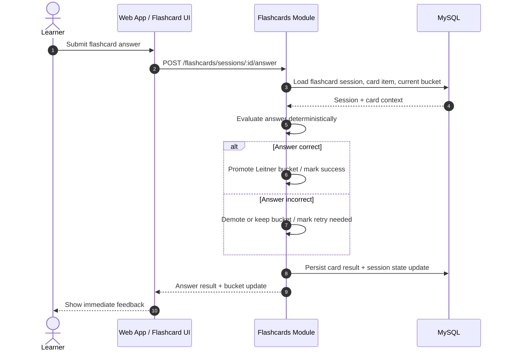

# Flashcard + Answer Evaluation Sequence Diagram

## Scope
- Diagram ini hanya memodelkan flow flashcard sampai hasil jawaban tersimpan di database milik module `flashcards`.
- Flow berhenti sebelum `record learning event` dikirim ke module `progress`.
- Diagram ini fokus ke ownership internal `flashcards` untuk evaluasi jawaban dan update session state.

## Sequence Diagram

## Key Decisions Locked By This Diagram
- `flashcards` tetap menjadi owner untuk evaluasi jawaban flashcard dan perubahan Leitner bucket.
- Semua hasil evaluasi dan perubahan bucket disimpan dulu di storage milik `flashcards` sebelum ada handoff ke module lain.
- Handoff ke `progress` sengaja dipisah ke diagram lain agar boundary ownership lebih jelas.

## Expected Outcome
- Satu jawaban flashcard selesai diproses penuh di boundary `flashcards` sampai state internalnya aman tersimpan.
- Setelah titik ini, flow bisa dilanjutkan ke diagram [update-progress-snapshot.md](./update-progress-snapshot.md).
