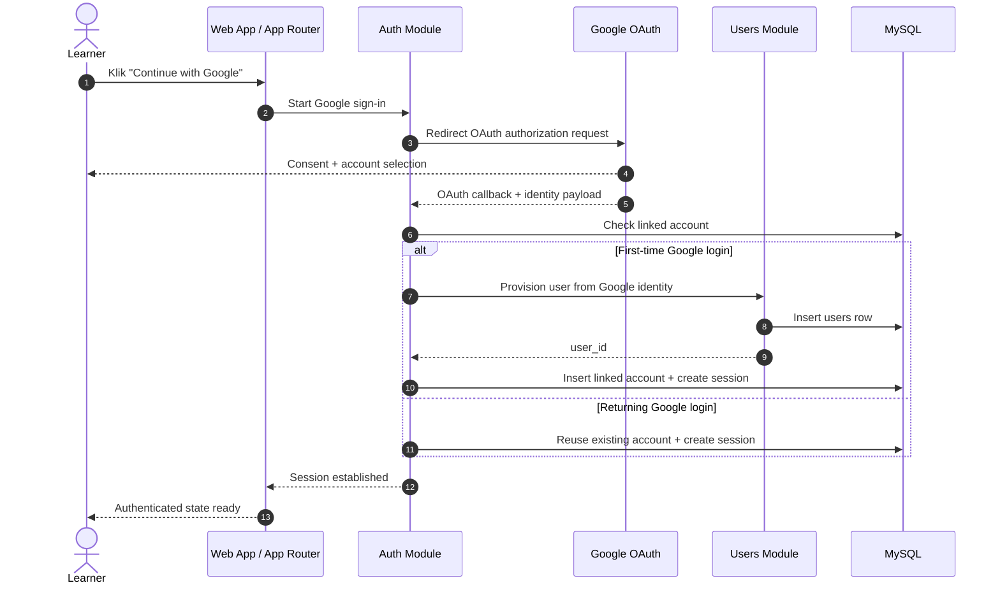

# Login (Until Session Established) Sequence Diagram

## Scope
- Diagram ini hanya memodelkan flow login Google sampai session berhasil dibuat.
- Flow berhenti di titik `session established`, belum masuk ke pemeriksaan onboarding atau redirect ke dashboard.
- Fokus utamanya ada pada boundary `auth -> users` saat provisioning user pertama kali.

## Sequence Diagram

## Key Decisions Locked By This Diagram
- `auth` tetap menjadi owner untuk login flow, account linking, dan session lifecycle.
- Pada login pertama, `auth` boleh memicu provisioning user dasar lewat `users`.
- Session dibuat setelah account linkage valid, bukan langsung dari payload Google tanpa persistence internal.

## Expected Outcome
- Login Google selalu berakhir pada session aktif yang siap dipakai oleh route guard atau flow onboarding berikutnya.
