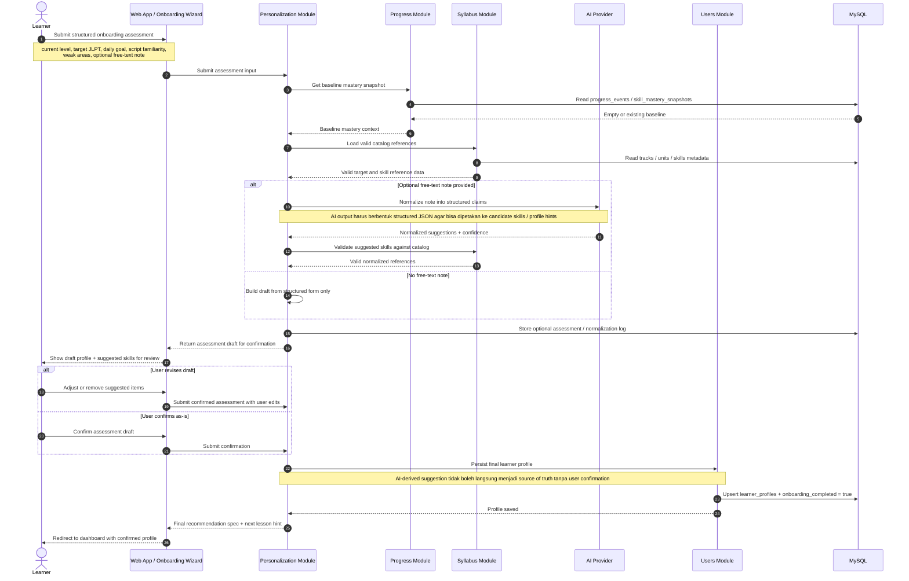

# Personalization Assessment -> AI Normalization -> User Confirmation -> Learner Profile Update Sequence Diagram

## Scope
- Diagram ini memodelkan detail flow `ARCH-07` yang sebelumnya belum dipecah di diagram onboarding umum.
- Fokus utamanya adalah bagaimana input assessment diproses menjadi draft personalization, kapan AI normalization dipakai, kapan user harus konfirmasi, dan kapan `learner_profile` baru boleh disimpan.
- Diagram ini melengkapi `onboarding-personalization.md`, bukan menggantikannya.

## Sequence Diagram

## Key Decisions Locked By This Diagram
- `personalization` boleh memakai AI untuk menormalisasi catatan bebas user, tetapi hasil AI hanya menghasilkan draft yang masih perlu dikonfirmasi user.
- `syllabus` tetap dipakai untuk memvalidasi target belajar dan skill hasil normalisasi agar tidak ada referensi di luar katalog resmi.
- `users` tetap menjadi owner untuk persistence `learner_profile`; `personalization` hanya menghitung dan mengirim hasil final yang sudah dikonfirmasi.
- Structured form tetap menjadi baseline utama. AI normalization bersifat opsional dan hanya memperkaya input saat user memberikan free-text note.

## Expected Outcome
- Assessment onboarding bisa menerima kombinasi structured form dan optional free-text note tanpa membuat AI menjadi source of truth tunggal.
- User selalu melihat dan mengonfirmasi draft akhir sebelum profile disimpan sebagai state resmi sistem.
