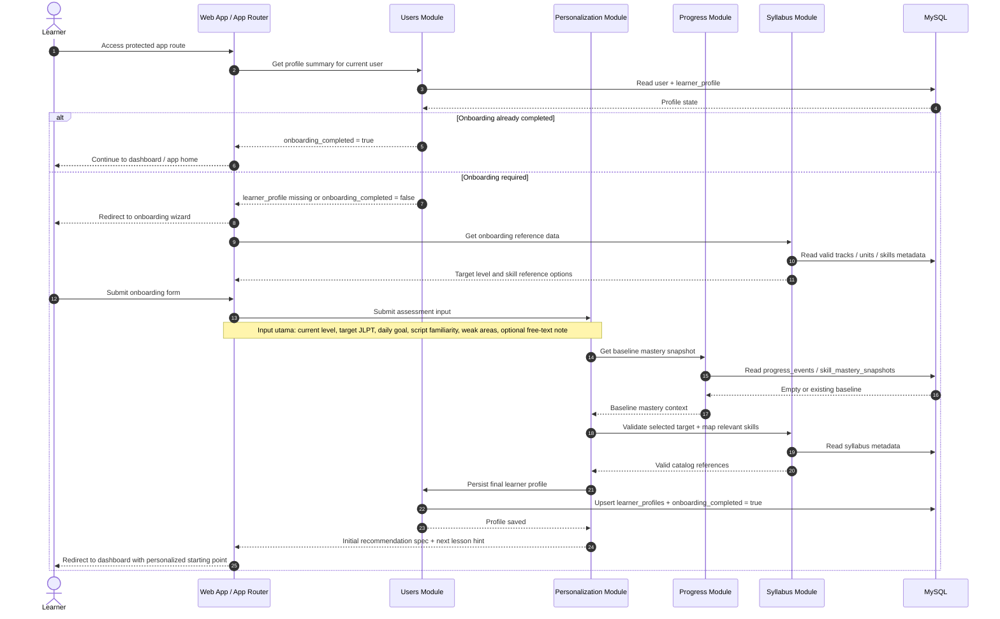

# Onboarding Personalization Sequence Diagram

## Scope
- Diagram ini memodelkan alur setelah user sudah punya session aktif dan mencoba masuk ke area aplikasi.
- Diagram mencakup dua kondisi: user yang sudah selesai onboarding dan user yang masih perlu onboarding personalization.
- Flow login sengaja tidak diulang di sini; titik awalnya adalah `session established`.
- Detail khusus `AI normalization -> user confirmation -> learner profile update` dipecah lagi ke diagram `ARCH-07`.

## Sequence Diagram

## Key Decisions Locked By This Diagram
- `users` tetap menjadi owner untuk status `onboarding_completed` dan persistence `learner_profile`.
- `personalization` mengolah input onboarding, membaca baseline dari `progress`, dan memvalidasi referensi ke `syllabus`.
- Jika onboarding sudah selesai, flow berhenti cepat di route guard tanpa memanggil ulang proses personalization.

## Expected Outcome
- User yang sudah onboarding langsung masuk ke area belajar.
- User yang belum onboarding diarahkan ke wizard, lalu disimpan sebagai `learner_profile` yang siap dipakai untuk recommendation awal.
- Untuk detail tahap draft/confirmation hasil normalisasi AI, lihat [personalization-assessment-ai-normalization-user-confirmation-learner-profile-update.md](./personalization-assessment-ai-normalization-user-confirmation-learner-profile-update.md).
