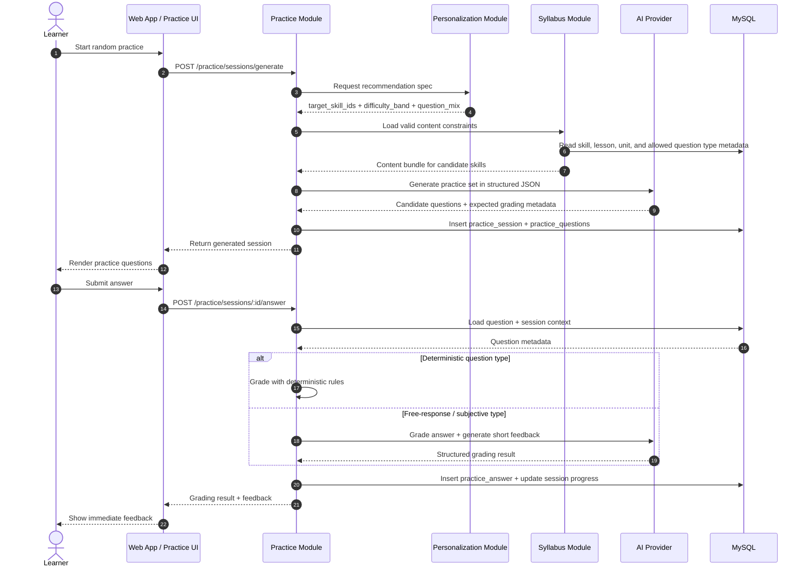

# Random Question Generator + Answer Evaluation Sequence Diagram

## Scope
- Diagram ini memodelkan flow practice session sampai hasil jawaban tersimpan di database milik module `practice`.
- Flow berhenti sebelum `record learning event` dikirim ke module `progress`.
- Diagram menggabungkan dua fase yang masih satu ownership: question generation dan answer evaluation.

## Sequence Diagram

## Key Decisions Locked By This Diagram
- `practice` menjadi owner untuk session generation, question storage, answer evaluation, dan session-state update.
- `personalization` hanya menyuplai recommendation spec, bukan question payload final.
- AI dipakai untuk generation dan grading yang memang membutuhkannya, sementara question deterministik tetap bisa dinilai langsung di `practice`.
- Flow ini sengaja berhenti di persistence internal `practice`; penulisan ke `progress` dipisah ke diagram lain.

## Expected Outcome
- Practice session bisa digenerate dan dinilai penuh dalam boundary `practice`.
- Setelah hasil jawaban tersimpan, sistem siap menjalankan handoff terpisah ke `progress`.
- Setelah titik ini, flow bisa dilanjutkan ke diagram [update-progress-snapshot.md](./update-progress-snapshot.md).
