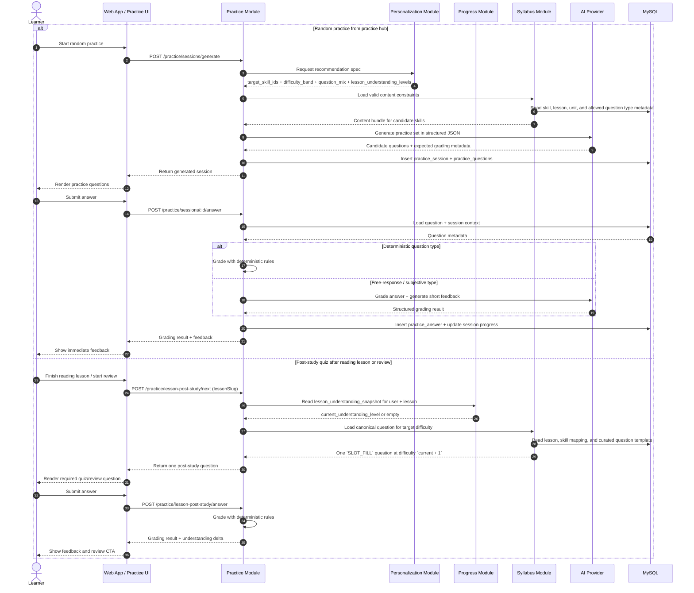

# Random Question Generator + Answer Evaluation Sequence Diagram

## Scope
- Diagram ini memodelkan flow random practice session dan direct lesson post-study quiz sampai hasil jawaban siap dikirim ke module `progress`.
- Flow berhenti sebelum `record learning event` dikirim ke module `progress`.
- Diagram menggabungkan dua fase yang masih satu ownership: question generation dan answer evaluation.

## Sequence Diagram

```mermaid
sequenceDiagram
    autonumber
    actor Learner
    participant App as Web App / Practice UI
    participant Practice as Practice Module
    participant Personalization as Personalization Module
    participant Progress as Progress Module
    participant Syllabus as Syllabus Module
    participant AI as AI Provider
    participant DB as MySQL

    alt Random practice from practice hub
        Learner->>App: Start random practice
        App->>Practice: POST /practice/sessions/generate
        Practice->>Personalization: Request recommendation spec
        Personalization-->>Practice: target_skill_ids + difficulty_band + question_mix + lesson_understanding_levels

        Practice->>Syllabus: Load valid content constraints
        Syllabus->>DB: Read skill, lesson, unit, and allowed question type metadata
        Syllabus-->>Practice: Content bundle for candidate skills

        Practice->>AI: Generate practice set in structured JSON
        AI-->>Practice: Candidate questions + expected grading metadata

        Practice->>DB: Insert practice_session + practice_questions
        Practice-->>App: Return generated session
        App-->>Learner: Render practice questions

        Learner->>App: Submit answer
        App->>Practice: POST /practice/sessions/:id/answer
        Practice->>DB: Load question + session context
        DB-->>Practice: Question metadata

        alt Deterministic question type
            Practice->>Practice: Grade with deterministic rules
        else Free-response / subjective type
            Practice->>AI: Grade answer + generate short feedback
            AI-->>Practice: Structured grading result
        end

        Practice->>DB: Insert practice_answer + update session progress
        Practice-->>App: Grading result + feedback
        App-->>Learner: Show immediate feedback
    else Post-study quiz after reading lesson or review
        Learner->>App: Finish reading lesson / start review
        App->>Practice: POST /practice/lesson-post-study/next (lessonSlug)
        Practice->>Progress: Read lesson_understanding_snapshot for user + lesson
        Progress-->>Practice: current_understanding_level or empty
        Practice->>Syllabus: Load canonical question for target difficulty
        Syllabus->>DB: Read lesson, skill mapping, and curated question template
        Syllabus-->>Practice: One `SLOT_FILL` question at difficulty `current + 1`
        Practice-->>App: Return one post-study question
        App-->>Learner: Render required quiz/review question

        Learner->>App: Submit answer
        App->>Practice: POST /practice/lesson-post-study/answer
        Practice->>Practice: Grade with deterministic rules
        Practice-->>App: Grading result + understanding delta
        App-->>Learner: Show feedback and review CTA
    end
```

## Key Decisions Locked By This Diagram
- `practice` menjadi owner untuk session generation, question storage, answer evaluation, dan session-state update.
- `personalization` hanya menyuplai recommendation spec, bukan question payload final.
- Flow practice punya dua entry utama pada MVP: random practice dari hub sebagai session dan `post-study quiz` setelah learner selesai membaca lesson sebagai direct one-question quiz.
- Untuk `post-study quiz`, lesson source tetap menjadi batas utama pemilihan skill dan isi soal berasal dari bank soal kurasi resmi `syllabus`.
- Bank soal lesson berisi `10` tingkat kesulitan, dan satu attempt `post-study quiz` selalu mengambil tepat `1` soal berdasarkan `lesson_understanding_snapshots.current_understanding_level + 1`.
- AI dipakai untuk generation dan grading yang memang membutuhkannya pada random practice; `post-study quiz` lesson tetap deterministik penuh.
- Flow ini sengaja berhenti sebelum update progress final; penulisan `progress_events`, `skill_mastery_snapshots`, dan `lesson_understanding_snapshots` dipisah ke diagram lain.

## Expected Outcome
- Practice session bisa digenerate dan dinilai penuh dalam boundary `practice`.
- Setelah hasil jawaban tersimpan, sistem siap menjalankan handoff terpisah ke `progress`.
- Setelah titik ini, flow bisa dilanjutkan ke diagram [update-progress-snapshot.md](./update-progress-snapshot.md).
