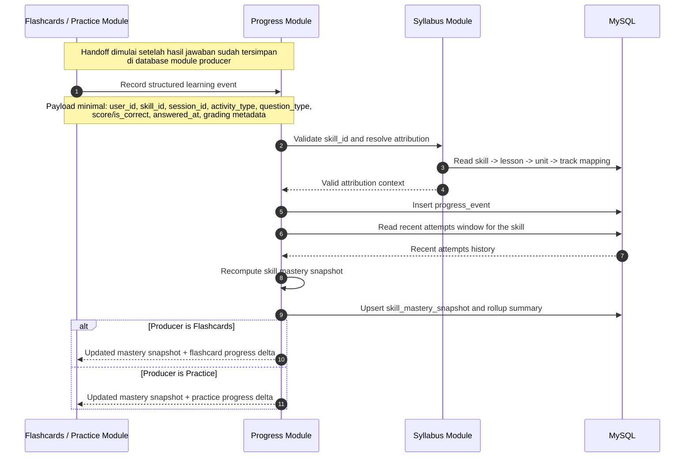

# Update Progress Snapshot Sequence Diagram

## Scope
- Diagram ini memodelkan handoff setelah hasil jawaban sudah tersimpan di module producer, baik dari `flashcards` maupun `practice`.
- Fokus utamanya adalah proses `record learning event -> validate attribution -> recompute mastery -> upsert snapshot`.
- Diagram ini menjadi flow bersama untuk update progress setelah practice activity apa pun.

## Sequence Diagram

## Key Decisions Locked By This Diagram
- `progress` tetap menjadi source of truth untuk `progress_events` dan `skill_mastery_snapshots`.
- Producer activity seperti `flashcards` dan `practice` tidak menulis langsung ke storage milik `progress`.
- `syllabus` dipakai sebagai validator resmi untuk memastikan attribution skill selalu sah sebelum event disimpan.
- Recompute snapshot terjadi segera setelah event baru masuk, sehingga feedback loop ke UI dan recommendation berikutnya tetap write-through.

## Expected Outcome
- Baik flashcard maupun random question mengikuti jalur update progress yang sama setelah result internal mereka tersimpan.
- Snapshot mastery terbaru selalu tersedia segera setelah satu interaction selesai diproses.
